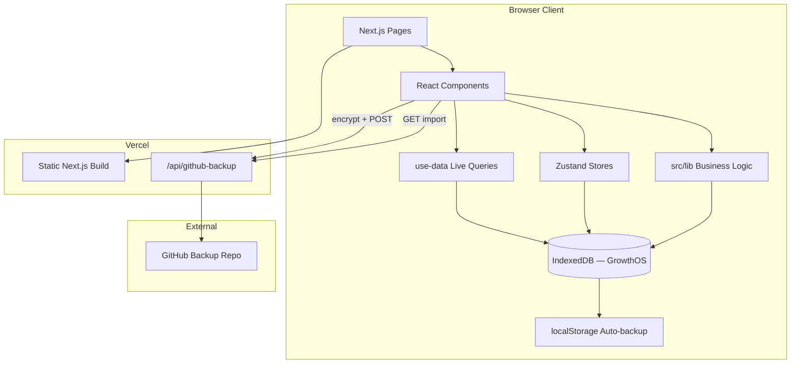

# GoalTrack — Architecture & Functionality

Personal learning command center for tracking study time, progress, and goals across multiple learning tracks. All user data lives in the browser (IndexedDB); Vercel hosts the static Next.js app only.

---

## Table of Contents

1. [Overview](#overview)
2. [Tech Stack](#tech-stack)
3. [Project Structure](#project-structure)
4. [Architecture](#architecture)
5. [Data Model](#data-model)
6. [Pages & Routing](#pages--routing)
7. [Components](#components)
8. [State Management](#state-management)
9. [Business Logic (`src/lib`)](#business-logic-srclib)
10. [API Routes](#api-routes)
11. [Backup & Data Portability](#backup--data-portability)
12. [Design System](#design-system)
13. [Key User Flows](#key-user-flows)
14. [Deployment](#deployment)
15. [Known Gaps / Future Work](#known-gaps--future-work)

---

## Overview

**GoalTrack** (internal DB name: `GrowthOS`) is a client-first PWA for managing structured learning:

- **5 default tracks:** CS Fundamentals, LeetCode, Development, System Design, Academic
- **Hierarchy:** Track → Module → Topic → Subtopic
- **Time tracking:** Focus timer with hierarchy context, manual time entry
- **Goals:** Tiered yearly hours (Minimum / Target / Stretch), scoped goal milestones
- **Insights:** Momentum scoring, daily pace, track health, smart insights
- **Reflection:** Journal entries, achievements, annual review

There is no server-side database. Each browser/device maintains its own IndexedDB instance.

---

## Tech Stack

| Layer | Technology |
|-------|------------|
| Framework | Next.js 15 (App Router, Turbopack in dev) |
| UI | React 19, TypeScript 5 |
| Styling | Tailwind CSS v4, custom glass/dark theme tokens |
| Database | Dexie 4 (IndexedDB) + `dexie-react-hooks` live queries |
| Client state | Zustand 5 (timer persistence, UI shell) |
| Charts | Recharts 2 |
| Animation | Framer Motion 12 |
| Icons | Tabler Icons (primary), Lucide (legacy spots) |
| Forms | react-hook-form + Zod |
| DnD | @dnd-kit (hierarchy reorder) |
| UI primitives | Radix UI + CVA + clsx/tailwind-merge |
| Dates | date-fns 4 |
| Fonts | Inter, Geist Mono |

**Scripts:** `npm run dev` · `npm run build` · `npm run start` · `npm run lint`

**Path alias:** `@/*` → `./src/*`

---

## Project Structure

```
GoalTrack/
├── public/
│   ├── icon.svg              # PWA icon
│   ├── logo.svg              # Brand logo
│   └── manifest.json         # PWA manifest (dark theme)
│
├── src/
│   ├── app/                  # Next.js App Router pages
│   │   ├── layout.tsx        # Root layout, fonts, AppShell wrapper
│   │   ├── globals.css       # Tailwind v4 + design tokens
│   │   ├── page.tsx          # Dashboard (/)
│   │   ├── tracks/
│   │   ├── milestones/
│   │   ├── status/
│   │   ├── analytics/
│   │   ├── journal/
│   │   ├── achievements/
│   │   ├── review/
│   │   ├── settings/
│   │   ├── in-progress/      # Redirect → /status
│   │   └── api/
│   │       └── github-backup/route.ts
│   │
│   ├── components/
│   │   ├── layout/           # Shell, sidebar, mobile header, countdown
│   │   ├── dashboard/        # Track cards, insights, momentum, tiered goals
│   │   ├── tracks/           # Hierarchy tree, estimation panels/charts
│   │   ├── milestones/       # Goal cards, dialogs, timeline, suggestions
│   │   ├── timer/            # Focus widget, controls, quality prompt
│   │   ├── charts/           # Forecast, radar (Recharts wrappers)
│   │   ├── journal/          # Hierarchy picker
│   │   ├── settings/         # GitHub backup, MD import panels
│   │   ├── shared/           # Stat cards, heatmap, section headings
│   │   ├── providers/        # Auto-backup, achievement checker
│   │   └── ui/               # shadcn-style Radix primitives
│   │
│   ├── hooks/
│   │   └── use-data.ts       # Dexie live-query hooks for all tables
│   │
│   ├── lib/                  # Business logic (see §9)
│   │   ├── types/
│   │   │   └── metrics.ts    # TieredGoal, MomentumBreakdown, SkipLog, etc.
│   │   ├── db.ts             # Dexie schema + migrations (v11)
│   │   ├── types.ts          # Core domain interfaces
│   │   ├── seed.ts           # Initial data + export/import
│   │   ├── crud.ts           # Hierarchy CRUD
│   │   ├── analytics.ts      # Aggregations, insights, forecasts
│   │   ├── metrics.ts        # Pace, momentum, track health
│   │   ├── goals.ts          # Tiered goal resolution
│   │   ├── status.ts         # Daily timeline, urgency alerts
│   │   ├── in-progress.ts    # Completion logic, due dates
│   │   ├── goal-milestones.ts
│   │   ├── track-estimation.ts
│   │   ├── achievements.ts
│   │   ├── time-log.ts
│   │   ├── utils.ts
│   │   ├── md-import.ts
│   │   ├── auto-backup.ts
│   │   ├── backup-crypto.ts
│   │   ├── github-sync.ts
│   │   └── insight-format.ts
│   │
│   └── stores/
│       ├── app-store.ts      # UI shell, achievements celebration
│       └── timer-store.ts    # Focus timer (persisted)
│
├── package.json
├── tsconfig.json
├── next.config.ts
├── postcss.config.mjs
├── eslint.config.mjs
├── vercel.json
└── README.md
```

---

## Architecture



### Layering

| Layer | Responsibility |
|-------|----------------|
| **Pages** (`src/app/`) | Route-level composition, data fetching via hooks |
| **Components** | Presentation, user interaction, local UI state |
| **Hooks** (`use-data.ts`) | Reactive Dexie queries (`useLiveQuery`) |
| **Stores** (Zustand) | Ephemeral UI state + persisted timer |
| **Lib** | Pure business logic, aggregations, CRUD, migrations |
| **Dexie** | Persistence, schema versioning, IndexedDB access |

### Boot Sequence

1. `AppShell` mounts → calls `seedDatabase()` if empty
2. Seed checks: existing tracks → localStorage auto-backup → default seed data
3. `app-store.initialized` flips true → pages render
4. `AutoBackupProvider` starts 45s backup loop
5. `AchievementChecker` watches session changes for unlocks

---

## Data Model

### Entity Hierarchy

```
Track
 └── Module
      └── Topic
           └── Subtopic
```

### Dexie Tables

| Table | Key | Purpose |
|-------|-----|---------|
| `tracks` | `id` | Top-level learning areas (CS, LeetCode, etc.) |
| `modules` | `id` | Grouped sections within a track |
| `topics` | `id` | Learnable units with difficulty, status, due dates |
| `subtopics` | `id` | Atomic study items |
| `sessions` | `id` | Time logs (timer or manual) |
| `journal` | `id` | Reflective entries linked to hierarchy |
| `achievements` | `id` | Unlockable badges |
| `milestones` | `id` | Auto-generated hour/achievement events |
| `goalMilestones` | `id` | User-defined scoped goals with timelines |
| `trackEstimates` | `trackId` | Per-track completion deadline config |
| `settings` | `id` | Singleton app config (`"default"`) |
| `skipLogs` | `id` | Reasons for zero-study days |

### Schema Versions

| Version | Change |
|---------|--------|
| 1 | Initial schema |
| 2 | `subtopics.dueDate` index |
| 3 | `topics.status`, `topics.dueDate` |
| 4 | Rename "CPS Fundamentals" → "CS Fundamentals" |
| 5 | Journal hierarchy indexes |
| 6 | Backfill `statusChangedAt` on topics/subtopics |
| 7 | Cap in-progress subtopic due dates to parent topic |
| 8 | Add `goalMilestones` table |
| 9 | Migrate calendar-year settings → Jun 2026 – Apr 2027 |
| 10 | Add `trackEstimates`; fix `yearEnd` to `2026-12-31` |
| 11 | Add `skipLogs`; seed tiered goals (300/700/2000h) |

### Core Types

**ProgressStatus:** `not_started` · `in_progress` · `completed` · `mastered`

**Difficulty:** `easy` · `medium` · `hard` · `expert`

**LearningSession:**
- `duration` (ms), hierarchy refs (`trackId`, `moduleId`, `topicId`, `subtopicId`)
- `manual` flag, optional `qualityRating` (1 = Distracted, 2 = Normal, 3 = Deep focus)

**AppSettings** (singleton):
- `yearStart`, `yearEnd`, `yearlyHourGoal`, `dailyHourGoal`, `theme`
- `tieredGoal`: `{ minimum, target, stretch, year }`
- `leetCodeStats`: `{ easy, medium, hard }` problem counts
- `trackSettings`: per-track neglect threshold, allocation %

**GoalMilestone:** Scoped to track/module/topic(s) with `startDate`, `months`, `endDate`, progress targets

### Default Seed Tracks

1. **CS Fundamentals** — Number Theory, Graph Theory
2. **LeetCode** — Data Structures, Algorithms
3. **Development** — Backend Engineering, DevOps
4. **System Design** — Core Concepts, Case Studies
5. **Academic** — Computer Science theory/math

Default settings: year `2026-06-01`–`2026-12-31`, daily 3h, tiered 300/700/2000h.

---

## Pages & Routing

| Route | File | Functionality |
|-------|------|---------------|
| `/` | `page.tsx` | **Dashboard** — stat row, daily pace, weekly consistency, momentum breakdown, track cards, insights, activity heatmap, tiered goal forecast, growth radar |
| `/tracks` | `tracks/page.tsx` | **Learning Tracks** — hierarchical CRUD tree with drag-and-drop, status/difficulty/due dates, inline timer start, track estimation panel. Supports deep links: `?track=&module=&topic=&subtopic=` |
| `/milestones` | `milestones/page.tsx` | **Goal Milestones** — create/edit scoped goals, pace tracking (ahead/on track/behind), timeline chart, suggested milestones when empty |
| `/status` | `status/page.tsx` | **Status** — daily timeline by date, urgency alerts, topic status filters, inline timer controls, goal milestone links |
| `/analytics` | `analytics/page.tsx` | **Analytics** — hours distribution, heatmap, velocity, efficiency (quality-weighted), completion trends |
| `/journal` | `journal/page.tsx` | **Journal** — structured entries (learned/challenges/takeaways/next actions), hierarchy picker, session linking |
| `/achievements` | `achievements/page.tsx` | **Achievements** — unlock gallery + system milestones |
| `/review` | `review/page.tsx` | **Annual Review** — printable year summary, export/share |
| `/settings` | `settings/page.tsx` | **Settings** — tiered goal inputs, export/import JSON, GitHub encrypted backup, markdown import, manual time entry |
| `/in-progress` | `in-progress/page.tsx` | **Legacy redirect** → `/status` |

### Navigation Groups

| Group | Items |
|-------|-------|
| **Learn** | Dashboard, Tracks, Milestones, Status (urgency badge) |
| **Insights** | Analytics, Journal, Achievements, Annual Review |
| **System** | Settings |

---

## Components

### Layout (`components/layout/`)

| Component | Role |
|-----------|------|
| `app-shell.tsx` | DB seed, loading screen, sidebar, global widgets (timer, skip prompt) |
| `sidebar.tsx` | Desktop nav, mobile drawer, urgency badge, day countdown % |
| `mobile-header.tsx` | Mobile top bar + hamburger |
| `logo.tsx` | Brand mark |
| `day-countdown.tsx` | Percentage of year elapsed |

### Dashboard (`components/dashboard/`)

| Component | Role |
|-----------|------|
| `track-card.tsx` | Per-track progress bar, health dot, next-up CTA, LeetCode stats, streak |
| `insights-panel.tsx` | Top smart insights with bold metric highlights |
| `tiered-goal-panel.tsx` | Minimum/Target/Stretch progress + reframe message |
| `momentum-breakdown.tsx` | 4-dimension momentum score bars |
| `skip-reason-prompt.tsx` | Floating prompt when yesterday had zero study time |
| `status-panel.tsx` | Auxiliary status summary widget |

### Tracks (`components/tracks/`)

| Component | Role |
|-----------|------|
| `hierarchy-tree.tsx` | Full CRUD tree, DnD reorder, status/difficulty/due dates, timer start |
| `track-estimation-panel.tsx` | Per-track completion deadline configuration |
| `track-estimation-chart.tsx` | Target vs actual vs projected progress chart |

### Milestones (`components/milestones/`)

| Component | Role |
|-----------|------|
| `goal-milestone-card.tsx` | Single goal with pace status indicator |
| `goal-milestone-dialog.tsx` | Create/edit goal with scope picker |
| `goal-timeline-chart.tsx` | Multi-goal timeline visualization |
| `suggested-milestones.tsx` | Suggested goals derived from track structure |
| `goal-scope-sync-panel.tsx` | Sync goal scope with hierarchy changes |

### Timer (`components/timer/`)

| Component | Role |
|-----------|------|
| `focus-widget.tsx` | Fixed bottom timer UI; triggers quality prompt on stop |
| `timer-controls.tsx` | Inline start/pause/stop on Status page |
| `session-quality-prompt.tsx` | Post-session 1–3 rating (Distracted/Normal/Deep focus) |
| `manual-time-dialog.tsx` | Manual time entry dialog |

### Charts (`components/charts/`)

| Component | Role |
|-----------|------|
| `forecast-chart.tsx` | Actual vs projected hours with tier goal reference lines |
| `radar-chart.tsx` | Multi-dimension growth radar |

### Shared (`components/shared/`)

| Component | Role |
|-----------|------|
| `stat-card.tsx` | Animated glass metric card with Tabler icons |
| `section-heading.tsx` | Consistent 14px section headers with dividers |
| `activity-heatmap.tsx` | GitHub-style study heatmap |
| `circular-progress.tsx` | Circular progress ring |

### Providers (`components/providers/`)

| Component | Role |
|-----------|------|
| `auto-backup.tsx` | 45s localStorage backup loop + beforeunload |
| `achievement-checker.tsx` | Background achievement unlock on session changes |

### UI (`components/ui/`)

Radix-based primitives: `button`, `card`, `dialog`, `input`, `select`, `tabs`, `badge`, `progress`, `textarea`, `tooltip`

---

## State Management

### Dexie Live Queries (primary data reactivity)

`src/hooks/use-data.ts` exposes hooks for all tables:

- `useTracks()`, `useAllModules()`, `useAllTopics()`, `useAllSubtopics()`
- `useSessions()`, `useJournal()`, `useAchievements()`, `useMilestones()`
- `useGoalMilestones()`, `useTrackEstimates()`, `useSettings()`, `useSkipLogs()`

Components subscribe to IndexedDB changes reactively via `useLiveQuery`.

### Zustand Stores

**`app-store.ts`**
- `initialized` — DB seed complete
- `sidebarOpen` / `toggleSidebar` — mobile nav
- `insights` — cached insight list
- `celebrationAchievement` — achievement celebration trigger

**`timer-store.ts`** (persisted as `growth-os-timer`)
- Timer: `isRunning`, `isPaused`, `startedAt`, `accumulatedMs`
- Context: hierarchy path (`trackId`, `moduleId`, `topicId`, `subtopicId`), `activityLabel`
- `pendingQualitySessionId` — triggers post-stop quality prompt
- Actions: `start`, `pause`, `resume`, `stop` (writes `LearningSession` to Dexie), `getElapsedMs`, `clearQualityPrompt`

---

## Business Logic (`src/lib`)

| Module | Responsibility |
|--------|----------------|
| `db.ts` | Dexie class, schema, migrations, singleton `db` export |
| `types.ts` | Core domain interfaces (Track, Topic, Session, Settings, etc.) |
| `types/metrics.ts` | TieredGoal, MomentumBreakdown, TrackHealth, SkipLog, LeetCodeStats |
| `seed.ts` | Initial seed, `exportAllData()` / `importAllData()` |
| `crud.ts` | Hierarchy CRUD: create/rename/delete/archive/reorder; status sync topic↔subtopics; due date propagation |
| `analytics.ts` | Progress rollups, hours aggregations, forecast, radar data, `generateInsights()`, heatmaps, velocity/efficiency |
| `metrics.ts` | Daily pace, weekly consistency, momentum breakdown, track health/balance, next-up resolution, skip reason insights, quality weights |
| `goals.ts` | `resolveTieredGoal`, `getTieredGoalProgress`, `getGoalReframeMessage` |
| `status.ts` | Daily status timeline, urgency alerts, global counts, today snapshot |
| `in-progress.ts` | Topic completion logic, due date helpers, in-progress grouping/sorting |
| `goal-milestones.ts` | Goal CRUD, scope resolution, pace stats (ahead/on_track/behind/completed/overdue) |
| `track-estimation.ts` | Per-track deadline estimation, success probability, chart data |
| `achievements.ts` | Unlock checks (hours, streaks, completions) + milestone records |
| `time-log.ts` | Roll up logged ms by subtopic/topic/module/track; timer path matching |
| `utils.ts` | `cn`, date helpers, streaks, heatmap data, status/difficulty labels & colors |
| `md-import.ts` | Parse `#/##/-` markdown into hierarchy; import into module or track |
| `auto-backup.ts` | localStorage backup save/restore/download |
| `backup-crypto.ts` | PIN-based AES-GCM encrypt/decrypt (PBKDF2 250k iterations) |
| `github-sync.ts` | Client orchestration for GitHub backup via API route |
| `insight-format.ts` | Bold-highlight numbers/dates in insight messages for UI |

### Key Metrics

**Tiered Goals** (`goals.ts`)
- Minimum (300h), Target (700h), Stretch (2000h) for Jun–Dec 2026
- Progress % per tier, reframe messages when behind pace

**Daily Pace** (`metrics.ts` → `getDailyPaceTarget`)
- Hours needed today to stay on target tier given weeks remaining

**Weekly Consistency** (`getWeeklyConsistency`)
- Days meeting ≥80% of daily goal (this week vs last)

**Momentum Breakdown** (`getMomentumBreakdown`) — 4×25pt scores:
1. **Consistency** — study days in last 14 days
2. **Volume** — weekly hours vs target
3. **Velocity** — completion rate delta
4. **Balance** — neglected tracks count

**Track Health** (`getTrackBalance`)
- `healthy` / `at-risk` / `neglected` based on days since last session (configurable threshold)

**Next Up** (`resolveNextUpItem`)
- Auto-resolves or uses pinned next subtopic/topic/module per track

**Session Quality** (`getQualityWeight`)
- Weights: 0.7 (Distracted) · 1.0 (Normal) · 1.5 (Deep focus) — used in efficiency ROI

**Skip Logs** (`getDominantSkipReason`)
- Reasons: too-tired, too-busy, unclear-what-to-do, forgot, other
- ≥4 occurrences triggers actionable insight

---

## API Routes

### `GET /api/github-backup`

Fetches encrypted backup from a public GitHub repo.

- Query: `owner`, `repo`, `branch`, `path` (defaults: `shuvosb17/GoalTrack-Backup`, `main`, `backup.enc.json`)
- Returns `EncryptedBackupEnvelope` JSON
- `dynamic = "force-dynamic"`, `runtime = "nodejs"`

### `POST /api/github-backup`

Uploads encrypted backup to GitHub (server-side token).

- Requires env `GITHUB_BACKUP_TOKEN` on Vercel
- Body: `{ envelope, owner?, repo?, branch?, path? }`
- Upserts via GitHub Contents API (handles SHA for updates)
- Token never exposed to browser

---

## Backup & Data Portability

### Export/Import (JSON)

`exportAllData()` produces:

```json
{
  "version": 1,
  "exportedAt": "...",
  "tracks", "modules", "topics", "subtopics",
  "sessions", "journal", "achievements", "milestones",
  "goalMilestones", "trackEstimates", "settings", "skipLogs"
}
```

Import clears all tables and bulk-restores.

### Auto-Backup (localStorage)

- Keys: `growth-os-auto-backup`, `growth-os-auto-backup-time`
- Interval: every 45s + `beforeunload` + on data changes
- **Same-browser only** — not synced across devices or localhost vs production

### GitHub Encrypted Backup

1. User sets PIN → client encrypts export with AES-GCM
2. GET: fetch `backup.enc.json` from public repo (no token needed)
3. POST: upload via server route with `GITHUB_BACKUP_TOKEN`

### Markdown Import

Settings → Import from Markdown

| Syntax | Level |
|--------|-------|
| `# Heading` | Module (track-level import) |
| `## Heading` | Topic |
| `- Item` | Subtopic |

---

## Design System

Defined in `src/app/globals.css`:

| Token / Class | Purpose |
|---------------|---------|
| Dark zinc palette | Base background `#09090b` |
| `--color-metric` | Lavender `#e2d9ff` for metric values |
| `.glass-card` | Opaque glass surface (no backdrop-blur artifacts) |
| `.gradient-border` | Subtle gradient border treatment |
| `.metric-value` | Large metric typography (weight 500) |
| 0.5px borders | Fine border treatment |
| Track bar colors | Consistent per-track chart/card theming |

**UI patterns:**
- Tabler icons on stat cards and section headings
- 2px `#7c5cfc` active sidebar border + tint
- 3px track progress bars with health dots
- Framer Motion entrance animations on dashboard cards
- `renderInsightMessage()` bold-highlights key facts in insights
- Responsive: 6-col stat grid, mobile sidebar drawer, fixed bottom widgets

---

## Key User Flows

### Study Session

```
Tracks/Status → Start timer on subtopic
  → Focus widget runs (pause/resume)
  → Stop → SessionQualityPrompt (1–3)
  → LearningSession saved to Dexie
  → AchievementChecker may unlock badges
  → Auto-backup triggers
```

### Track Progress

```
Hierarchy tree: set subtopic status
  → Topic status auto-syncs from children
  → Progress rollups update dashboard track cards
  → "Next up" resolves to first incomplete item
  → Remaining count = all incomplete subtopics + topic-only items
```

### Goal Tracking

```
Settings: configure tiered goals (min/target/stretch)
  → Dashboard: TieredGoalPanel + ForecastChart reference lines
  → Daily pace: "Need today Xh" based on target tier
  → Reframe message when behind minimum pace
```

### Skip Day

```
Yesterday = 0 study hours AND no skipLog
  → SkipReasonPrompt appears in AppShell
  → User selects reason → saved to skipLogs
  → Dominant pattern (≥4) surfaces in insights
```

### Data Migration (localhost → Vercel)

```
Old browser: Settings → Export Full Backup (JSON)
New browser:  Settings → Import Backup
Alternative:  GitHub encrypted backup with PIN
```

---

## Deployment

### Vercel

```json
// vercel.json
{
  "framework": "nextjs",
  "buildCommand": "npm run build",
  "installCommand": "npm install"
}
```

- Push to `main` → Vercel auto-deploys
- No server database — each visitor has isolated IndexedDB
- **Required env for GitHub upload:** `GITHUB_BACKUP_TOKEN`

### PWA

- `public/manifest.json` — dark theme, `/icon.svg`
- Installable as standalone app on supported browsers

### Environment Isolation

| Environment | Storage |
|-------------|---------|
| Chrome | Separate IndexedDB |
| Edge | Separate IndexedDB |
| localhost vs vercel.app | Separate IndexedDB |

Data does not travel with deployment — export/import required.

---

## Known Gaps / Future Work

Items from the improvement spec not yet fully implemented:

| Feature | Status |
|---------|--------|
| Status page "Due for Review" filter tab | Not implemented |
| LeetCode "Add Problem" button on Tracks page | Not implemented |
| Analytics quality overlay on time chart | Not implemented |
| Analytics problems-per-week tab | Not implemented |
| Topic confidence rating on completion | Not implemented |
| Review scheduling from confidence | Not implemented |
| Per-track settings panel (neglect threshold, allocation %, LC targets) | Partial (types exist, no UI) |
| Momentum donut in stat row | Replaced by 4-bar breakdown in Growth Overview |

---

## Quick Reference

| Concept | Value |
|---------|-------|
| IndexedDB name | `GrowthOS` |
| Settings singleton ID | `"default"` |
| Default year | 2026-06-01 → 2026-12-31 |
| Tiered goals | 300h / 700h / 2000h |
| Daily goal default | 3h |
| Timer persist key | `growth-os-timer` |
| Auto-backup interval | 45 seconds |
| GitHub backup repo | `shuvosb17/GoalTrack-Backup` |
| Dexie schema version | 11 |
