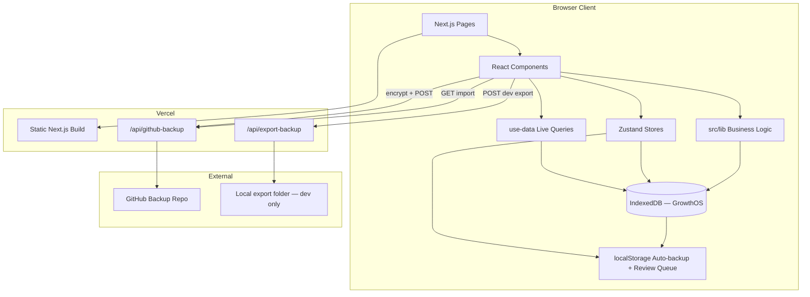

# GoalTrack — Architecture & Functionality

Personal learning command center for tracking study time, progress, and goals across multiple learning tracks. All user data lives in the browser (IndexedDB + persisted Zustand); Vercel hosts the static Next.js app only.

---

## Table of Contents

1. [Overview](#overview)
2. [Tech Stack](#tech-stack)
3. [Project Structure](#project-structure)
4. [Architecture](#architecture)
5. [Data Model](#data-model)
6. [Pages & Routing](#pages--routing)
7. [Components](#components)
8. [State Management](#state-management)
9. [Business Logic (`src/lib`)](#business-logic-srclib)
10. [Go Backend Path](#go-backend-path)
11. [LeetCode Prep & Pattern Notes](#leetcode-prep--pattern-notes)
12. [Spaced Review System](#spaced-review-system)
13. [API Routes](#api-routes)
14. [Backup & Data Portability](#backup--data-portability)
15. [Design System](#design-system)
16. [Key User Flows](#key-user-flows)
17. [Deployment](#deployment)
18. [Scripts & Docs](#scripts--docs)
19. [Known Gaps / Future Work](#known-gaps--future-work)

---

## Overview

**GoalTrack** (internal DB name: `GrowthOS`) is a client-first PWA for managing structured learning:

- **5 default tracks:** CS Fundamentals, LeetCode, Development, System Design, Academic
- **Hierarchy:** Track → Module → Topic → Subtopic
- **Time tracking:** Focus timer with hierarchy context, manual time entry, session quality ratings
- **Goals:** Tiered yearly hours (Minimum / Target / Stretch), scoped goal milestones
- **Insights:** Momentum scoring, daily pace, track health, smart insights, analytics KPIs
- **Reflection:** Journal entries with hierarchy links, achievements, annual review
- **LeetCode prep:** Pattern workspace, core problem bank, prep quizzes, mock rounds, interview readiness
- **Go backend path:** 24-module remote Go backend curriculum auto-imported into Development track
- **Spaced review:** Confidence-rated completions drive a review queue on the Status page

There is no server-side database. Each browser/device maintains its own IndexedDB instance.

---

## Tech Stack

| Layer | Technology |
|-------|------------|
| Framework | Next.js 15 (App Router, Turbopack in dev) |
| UI | React 19, TypeScript 5 |
| Styling | Tailwind CSS v4, custom glass/dark theme tokens |
| Database | Dexie 4 (IndexedDB) + `dexie-react-hooks` live queries |
| Client state | Zustand 5 (timer, review queue, UI shell) |
| Charts | Recharts 2, Chart.js 4 |
| Animation | Framer Motion 12 |
| Icons | Tabler Icons (primary), Lucide (legacy spots) |
| Forms | react-hook-form + Zod |
| DnD | @dnd-kit (hierarchy reorder) |
| Markdown | react-markdown + remark-gfm (pattern notes) |
| UI primitives | Radix UI + CVA + clsx/tailwind-merge |
| Dates | date-fns 4 |
| IDs | uuid 11 |
| Fonts | Inter, Geist Mono |

**Scripts:** `npm run dev` · `npm run build` · `npm run start` · `npm run lint`

**Path alias:** `@/*` → `./src/*`

---

## Project Structure

```
GoalTrack/
├── docs/
│   └── go-backend-path.md          # Human-readable Go backend curriculum export
│
├── public/
│   ├── icon.svg                    # PWA icon
│   ├── logo.svg                    # Brand logo
│   └── manifest.json               # PWA manifest (dark theme)
│
├── scripts/
│   ├── generate-go-backend-resources.mjs  # Build resource link catalog
│   ├── check-go-backend-links.mjs         # Validate curated URLs
│   └── fix-pattern-encoding.cjs           # Pattern notes maintenance
│
├── src/
│   ├── app/                        # Next.js App Router pages
│   │   ├── layout.tsx              # Root layout, fonts, AppShell wrapper
│   │   ├── globals.css             # Tailwind v4 + design tokens
│   │   ├── page.tsx                # Dashboard (/)
│   │   ├── tracks/
│   │   ├── milestones/
│   │   ├── status/
│   │   ├── analytics/
│   │   ├── journal/
│   │   │   └── go-backend/         # Go backend resource library
│   │   ├── achievements/
│   │   ├── review/
│   │   ├── settings/
│   │   ├── in-progress/          # Redirect → /status
│   │   └── api/
│   │       ├── github-backup/route.ts
│   │       └── export-backup/route.ts   # Dev-only local JSON export
│   │
│   ├── components/
│   │   ├── layout/                 # Shell, sidebar, mobile header, countdown
│   │   ├── dashboard/              # Track cards, insights, momentum, tiered goals
│   │   ├── tracks/                 # Hierarchy tree, LeetCode workspace, pattern notes
│   │   ├── milestones/             # Goal cards, dialogs, timeline, suggestions
│   │   ├── timer/                  # Focus widget, controls, quality prompt
│   │   ├── analytics/              # Time distribution, efficiency ROI, velocity, heatmaps
│   │   ├── status/                 # Timeline, review session, confidence UI
│   │   ├── charts/                 # Forecast, radar (Recharts wrappers)
│   │   ├── journal/                # Hierarchy picker, Go backend resources panel
│   │   ├── achievements/           # Rank hero, sprint lanes
│   │   ├── review/                 # Annual learning curve
│   │   ├── settings/               # GitHub backup, MD import panels
│   │   ├── shared/                 # Stat cards, heatmap, section headings
│   │   ├── providers/              # Auto-backup, achievements, prep quiz, confidence
│   │   └── ui/                     # shadcn-style Radix primitives
│   │
│   ├── hooks/
│   │   └── use-data.ts             # Dexie live-query hooks for all tables
│   │
│   ├── lib/
│   │   ├── types/
│   │   │   └── metrics.ts          # TieredGoal, LeetCode types, completion meta, etc.
│   │   ├── pattern-notes/          # Pattern study content (markdown blocks + viz)
│   │   ├── prep-quizzes/           # CS + pattern quiz banks
│   │   ├── go-backend-resources/   # Generated link catalog (data.generated.ts)
│   │   ├── db.ts                   # Dexie schema + migrations (v14)
│   │   ├── types.ts                # Core domain interfaces
│   │   ├── seed.ts                 # Initial data, Go path import, export/import
│   │   ├── crud.ts                 # Hierarchy CRUD
│   │   ├── analytics.ts            # Aggregations, insights, forecasts
│   │   ├── analytics-card-insights.ts
│   │   ├── metrics.ts              # Pace, momentum, review due dates
│   │   ├── goals.ts                # Tiered goal resolution
│   │   ├── status.ts               # Daily timeline, urgency alerts
│   │   ├── status-summary.ts
│   │   ├── in-progress.ts          # Completion logic, due dates
│   │   ├── goal-milestones.ts
│   │   ├── track-estimation.ts
│   │   ├── achievements.ts
│   │   ├── time-log.ts
│   │   ├── utils.ts
│   │   ├── md-import.ts
│   │   ├── auto-backup.ts
│   │   ├── backup-crypto.ts
│   │   ├── github-sync.ts
│   │   ├── insight-format.ts
│   │   ├── go-backend-path.ts      # 24-module curriculum source
│   │   ├── go-backend-projects.ts  # Per-module project definitions
│   │   ├── go-backend-import.ts    # Path → hierarchy import helpers
│   │   ├── leetcode-patterns.ts    # Pattern metadata + core problems
│   │   ├── leetcode-readiness.ts   # BD-CORE readiness scoring
│   │   ├── leetcode-confidence-prompt.ts
│   │   ├── interview-readiness-check.ts
│   │   ├── revision-catalog.ts     # Review queue item builder
│   │   ├── revision-sessions.ts
│   │   ├── review.ts
│   │   ├── confidence-prompt.ts
│   │   ├── prep-quiz-prompt.ts
│   │   ├── journal-links.ts
│   │   ├── export-folder.ts
│   │   ├── format-learning-text.ts
│   │   ├── session-repair.ts
│   │   ├── track-sparkline.ts
│   │   └── urgency-alerts.ts
│   │
│   └── stores/
│       ├── app-store.ts            # UI shell, achievements celebration
│       ├── timer-store.ts          # Focus timer (persisted)
│       └── review-store.ts         # Spaced review queue (persisted)
│
├── package.json
├── tsconfig.json
├── next.config.ts
├── postcss.config.mjs
├── eslint.config.mjs
├── vercel.json
└── README.md
```

---

## Architecture



### Layering

| Layer | Responsibility |
|-------|----------------|
| **Pages** (`src/app/`) | Route-level composition, data fetching via hooks |
| **Components** | Presentation, user interaction, local UI state |
| **Hooks** (`use-data.ts`) | Reactive Dexie queries (`useLiveQuery`) |
| **Stores** (Zustand) | Ephemeral UI state + persisted timer & review queue |
| **Lib** | Pure business logic, aggregations, CRUD, migrations, curriculum source |
| **Dexie** | Persistence, schema versioning, IndexedDB access |

### Boot Sequence

1. `AppShell` mounts → calls `seedDatabase()` if empty
2. Seed checks: existing tracks → localStorage auto-backup → default seed data
3. `ensureLeetcodePrep()` — seeds core LeetCode problems + CS review items
4. `ensureGoBackendPath()` — imports Go backend modules 0–23 into Development track (once)
5. `ensureGoBackendProjects()` — backfills new project topics on existing installs
6. `ensureInterviewReadyAchievement()` — adds interview-ready achievement definition
7. `repairMisattributedSessions()` — one-time session hierarchy fix
8. `app-store.initialized` flips true → pages render
9. Providers mount: `AutoBackupProvider`, `AchievementChecker`, `ConfidencePromptProvider`, `PrepQuizProvider`, `LeetcodeConfidenceProvider`, `InterviewReadinessChecker`

---

## Data Model

### Entity Hierarchy

```
Track
 └── Module
      └── Topic
           └── Subtopic
```

Project topics in the Go backend path use the prefix `Project: [Tier] …` and appear as regular topics with deliverable subtopics.

### Dexie Tables

| Table | Key | Purpose |
|-------|-----|---------|
| `tracks` | `id` | Top-level learning areas |
| `modules` | `id` | Grouped sections within a track |
| `topics` | `id` | Learnable units with difficulty, status, due dates, completion meta |
| `subtopics` | `id` | Atomic study items |
| `sessions` | `id` | Time logs (timer or manual) |
| `journal` | `id` | Reflective entries linked to hierarchy |
| `journalLinks` | `id` | Saved resource links tied to hierarchy nodes |
| `achievements` | `id` | Unlockable badges |
| `milestones` | `id` | Auto-generated hour/achievement events |
| `goalMilestones` | `id` | User-defined scoped goals with timelines |
| `trackEstimates` | `trackId` | Per-track completion deadline config |
| `settings` | `id` | Singleton app config (`"default"`) |
| `skipLogs` | `id` | Reasons for zero-study days |
| `leetcodeProblems` | `id` | Core problem bank per pattern |
| `csReviewItems` | `id` | CS fundamentals review checklist |
| `prepQuizAttempts` | `id` | Pattern/CS quiz attempt history |
| `mockRoundSessions` | `id` | Timed mock interview round logs |

### Schema Versions

| Version | Change |
|---------|--------|
| 1 | Initial schema |
| 2 | `subtopics.dueDate` index |
| 3 | `topics.status`, `topics.dueDate` |
| 4 | Rename "CPS Fundamentals" → "CS Fundamentals" |
| 5 | Journal hierarchy indexes |
| 6 | Backfill `statusChangedAt` on topics/subtopics |
| 7 | Cap in-progress subtopic due dates to parent topic |
| 8 | Add `goalMilestones` table |
| 9 | Migrate calendar-year settings → Jun 2026 – Apr 2027 |
| 10 | Add `trackEstimates`; fix `yearEnd` to `2026-12-31` |
| 11 | Add `skipLogs`; seed tiered goals (300/700/2000h) |
| 12 | Add `journalLinks` table |
| 13 | Add `leetcodeProblems`, `csReviewItems` |
| 14 | Add `prepQuizAttempts`, `mockRoundSessions` |

### Core Types

**ProgressStatus:** `not_started` · `in_progress` · `completed` · `mastered`

**Difficulty:** `easy` · `medium` · `hard` · `expert`

**LearningSession:**
- `duration` (ms), hierarchy refs (`trackId`, `moduleId`, `topicId`, `subtopicId`)
- `manual` flag, optional `qualityRating` (1 = Distracted, 2 = Normal, 3 = Deep focus)

**TopicCompletionMeta** (on topics/subtopics after completion):
- `confidenceRating` (1–5), `completedAt`, optional `confidenceRated`, `reviewSnoozedUntil`

**AppSettings** (singleton):
- `yearStart`, `yearEnd`, `yearlyHourGoal`, `dailyHourGoal`, `theme`
- `tieredGoal`: `{ minimum, target, stretch, year }`
- `leetCodeStats`, `leetCodeLog` (solve history)
- `trackSettings`: per-track neglect threshold, allocation %

**Review state** (Zustand persist, included in JSON backup):
- `queue`: `ReviewCatalogItem[]` — topics/subtopics due for spaced review
- `progress`: active revision session state
- `dismissedIds`: snoozed/dismissed review items

### Default Seed Tracks

1. **CS Fundamentals** — Number Theory, Graph Theory
2. **LeetCode** — Data Structures, Algorithms (+ pattern workspace when selected)
3. **Development** — Backend Engineering, DevOps (+ Go backend path modules on first boot)
4. **System Design** — Core Concepts, Case Studies
5. **Academic** — Computer Science theory/math

Default settings: year `2026-06-01`–`2026-12-31`, daily 3h, tiered 300/700/2000h.

---

## Pages & Routing

| Route | File | Functionality |
|-------|------|---------------|
| `/` | `page.tsx` | **Dashboard** — stat row, daily pace, weekly consistency, momentum breakdown, track cards, insights, activity heatmap, tiered goal forecast, growth radar, next-action card |
| `/tracks` | `tracks/page.tsx` | **Learning Tracks** — hierarchical CRUD tree with DnD, status/difficulty/due dates, inline timer. LeetCode track shows `LeetCodeWorkspace` (patterns, problems, quizzes, mock rounds). Deep links: `?track=&module=&topic=&subtopic=` |
| `/milestones` | `milestones/page.tsx` | **Goal Milestones** — create/edit scoped goals, pace tracking, timeline chart, smart insights, suggested milestones |
| `/status` | `status/page.tsx` | **Status** — daily timeline, urgency alerts, topic status filters, **Due for Review** tab, inline timer, review session panel, confidence dialogs |
| `/analytics` | `analytics/page.tsx` | **Analytics** — KPI row, time distribution, efficiency ROI (quality-weighted), consistency calendar, learning velocity, focus heatmap, completion trends, LeetCode problems/week |
| `/journal` | `journal/page.tsx` | **Journal** — structured entries, hierarchy picker, resource links; link to Go backend library |
| `/journal/go-backend` | `journal/go-backend/page.tsx` | **Go Backend Resource Library** — searchable curated links per subtopic (Modules 0–23) |
| `/achievements` | `achievements/page.tsx` | **Achievements** — unlock gallery, rank hero, sprint lanes |
| `/review` | `review/page.tsx` | **Annual Review** — printable year summary, learning curve |
| `/settings` | `settings/page.tsx` | **Settings** — tiered goals, export/import JSON, GitHub encrypted backup, markdown import, manual time entry |
| `/in-progress` | `in-progress/page.tsx` | **Legacy redirect** → `/status` |

### Navigation Groups

| Group | Items |
|-------|-------|
| **Learn** | Dashboard, Tracks, Milestones, Status (urgency badge) |
| **Insights** | Analytics, Journal, Achievements, Annual Review |
| **System** | Settings |

---

## Components

### Layout (`components/layout/`)

| Component | Role |
|-----------|------|
| `app-shell.tsx` | DB seed, boot migrations, loading screen, sidebar, global widgets |
| `sidebar.tsx` | Desktop nav, mobile drawer, urgency badge, day countdown % |
| `mobile-header.tsx` | Mobile top bar + hamburger |
| `logo.tsx` | Brand mark |
| `day-countdown.tsx` | Percentage of year elapsed |

### Dashboard (`components/dashboard/`)

| Component | Role |
|-----------|------|
| `track-card.tsx` | Per-track progress, health dot, next-up CTA, LeetCode stats, streak |
| `insights-panel.tsx` | Top smart insights with bold metric highlights |
| `tiered-goal-panel.tsx` | Minimum/Target/Stretch progress + reframe message |
| `goal-forecasting-panel.tsx` | Tier goal forecast visualization |
| `momentum-breakdown.tsx` | 4-dimension momentum score bars |
| `next-action-card.tsx` | Suggested next study action |
| `skip-reason-prompt.tsx` | Floating prompt when yesterday had zero study time |
| `status-panel.tsx` | Auxiliary status summary widget |

### Tracks (`components/tracks/`)

| Component | Role |
|-----------|------|
| `hierarchy-tree.tsx` | Full CRUD tree, DnD reorder, status/difficulty/due dates, timer start; recognizes Go backend project topics |
| `leetcode-workspace.tsx` | Pattern tabs, problem checklist, readiness charts, mock rounds |
| `leetcode-panel.tsx` | Pattern progress sidebar |
| `leetcode-readiness-charts.tsx` | BD-CORE readiness visualization |
| `pattern-notes/` | Markdown pattern study reader with TOC, viz blocks, sidebar |
| `prep-quiz-dialog.tsx` | Pattern/CS prep quiz UI |
| `mock-round-dialog.tsx` | Timed mock interview round |
| `topic-confidence-dialog.tsx` | Post-completion confidence rating (1–5) |
| `track-estimation-panel.tsx` | Per-track completion deadline configuration |
| `track-estimation-chart.tsx` | Target vs actual vs projected progress chart |
| `review-due-banner.tsx` | Banner when items are due for review |

### Analytics (`components/analytics/`)

| Component | Role |
|-----------|------|
| `time-distribution-card.tsx` | Hours by track with live insight |
| `efficiency-roi-card.tsx` | Quality-weighted efficiency with insight |
| `learning-velocity-panel.tsx` | Completion velocity + delta |
| `consistency-calendar.tsx` | Study-day calendar heatmap |
| `inconsistency-tracking-panel.tsx` | Skip/streak inconsistency analysis |
| `most-studied-topics-panel.tsx` | Top topics by logged time |
| `focus-hours-heatmap.tsx` | Hour-of-day focus heatmap |
| `focus-mode-panel.tsx` | Deep-focus session timeline |

### Status (`components/status/`)

| Component | Role |
|-----------|------|
| `status-summary-header.tsx` | Date-scoped status overview |
| `status-timeline-card.tsx` | Daily study timeline |
| `review-session-panel.tsx` | Spaced review session UI |
| `revision-quiz-dialog.tsx` | Quick revision quiz during review |
| `needs-attention-panel.tsx` | Overdue / at-risk items |
| `confidence-dots.tsx` | Visual confidence indicator |

### Milestones, Timer, Journal, Providers

See prior sections; key additions:
- `journal/go-backend-resources-panel.tsx` — filterable resource library
- `providers/confidence-prompt-provider.tsx` — prompts on topic completion
- `providers/prep-quiz-provider.tsx` — pattern quiz prompts
- `providers/leetcode-confidence-provider.tsx` — LeetCode-specific confidence flow
- `providers/interview-readiness-checker.tsx` — unlocks interview-ready achievement

### UI (`components/ui/`)

Radix-based primitives: `button`, `card`, `dialog`, `input`, `select`, `tabs`, `badge`, `progress`, `textarea`, `tooltip`

---

## State Management

### Dexie Live Queries (primary data reactivity)

`src/hooks/use-data.ts` exposes hooks for all tables:

- `useTracks()`, `useAllModules()`, `useAllTopics()`, `useAllSubtopics()`
- `useSessions()`, `useJournal()`, `useJournalLinks()`, `useAchievements()`, `useMilestones()`
- `useGoalMilestones()`, `useTrackEstimates()`, `useSettings()`, `useSkipLogs()`
- `useLeetcodeProblems()`, `useCsReviewItems()`, `usePrepQuizAttempts()`

Components subscribe to IndexedDB changes reactively via `useLiveQuery`.

### Zustand Stores

**`app-store.ts`**
- `initialized` — DB seed complete
- `sidebarOpen` / `toggleSidebar` — mobile nav
- `insights` — cached insight list
- `celebrationAchievement` — achievement celebration trigger

**`timer-store.ts`** (persisted as `growth-os-timer`)
- Timer: `isRunning`, `isPaused`, `startedAt`, `accumulatedMs`
- Context: hierarchy path, `activityLabel`
- `pendingQualitySessionId` — triggers post-stop quality prompt
- Actions: `start`, `pause`, `resume`, `stop` (writes `LearningSession` to Dexie)

**`review-store.ts`** (persisted as `goaltrack-review`)
- `queue` — spaced review items (`ReviewCatalogItem[]`)
- `progress` — active revision session
- `dismissedIds` — snoozed items
- Actions: `addToQueue`, `reconcileReviewQueue`, `startSession`, `finishSession`
- Included in JSON export/import via `getReviewStateForBackup()` / `restoreReviewStateFromBackup()`

---

## Business Logic (`src/lib`)

| Module | Responsibility |
|--------|----------------|
| `db.ts` | Dexie class, schema, migrations, singleton `db` export |
| `types.ts` / `types/metrics.ts` | Core domain + LeetCode/review/completion types |
| `seed.ts` | Initial seed, Go path import, LeetCode prep seed, export/import |
| `crud.ts` | Hierarchy CRUD; status sync; due dates; review snooze |
| `analytics.ts` | Progress rollups, hours, forecast, radar, insights, heatmaps, KPIs |
| `analytics-card-insights.ts` | Live insight strings for analytics cards |
| `metrics.ts` | Daily pace, momentum, track health, review due dates, skip insights |
| `goals.ts` | Tiered goal resolution and progress |
| `status.ts` / `status-summary.ts` | Daily timeline, urgency, snapshots |
| `in-progress.ts` | Completion logic, due date helpers, grouping |
| `goal-milestones.ts` | Scoped goal CRUD and pace stats |
| `track-estimation.ts` | Per-track deadline estimation |
| `achievements.ts` | Unlock checks + milestone records |
| `time-log.ts` | Roll up logged ms by hierarchy level |
| `leetcode-patterns.ts` | Pattern metadata, core problems, CS fundamentals list |
| `leetcode-readiness.ts` | BD-CORE readiness score |
| `revision-catalog.ts` | Build review catalog, due snapshots, queue reconciliation |
| `confidence-prompt.ts` | Confidence rating helpers |
| `prep-quizzes/` | Quiz banks + scoring for patterns and CS |
| `pattern-notes/` | Structured pattern study content loader |
| `go-backend-path.ts` | 24-module curriculum (101 topics, 423 subtopics) |
| `go-backend-projects.ts` | 43 projects with tier + deliverables |
| `go-backend-import.ts` | Convert path/projects → `md-import` topics |
| `go-backend-resources/` | Generated link catalog per subtopic |
| `md-import.ts` | Parse `#/##/-` markdown into hierarchy |
| `auto-backup.ts` | localStorage backup save/restore/download |
| `backup-crypto.ts` | PIN-based AES-GCM encrypt/decrypt |
| `github-sync.ts` | Client orchestration for GitHub backup API |
| `session-repair.ts` | One-time session hierarchy repair |
| `insight-format.ts` | Bold-highlight numbers in insight messages |

### Key Metrics

**Tiered Goals** — Minimum (300h), Target (700h), Stretch (2000h) for Jun–Dec 2026

**Momentum Breakdown** — 4×25pt: Consistency, Volume, Velocity, Balance

**Session Quality** — Weights: 0.7 / 1.0 / 1.5 — used in efficiency ROI

**Review Due** — Based on `completionMeta.confidenceRating` and elapsed time since completion

---

## Go Backend Path

Curriculum for remote junior Go backend roles, stored as TypeScript source and synced into the **Development** track.

### Source Files

| File | Role |
|------|------|
| `src/lib/go-backend-path.ts` | Module/topic/subtopic definitions (Modules 0–23) |
| `src/lib/go-backend-projects.ts` | Per-module projects with tier + deliverables |
| `src/lib/go-backend-import.ts` | Import helpers (`moduleTopicsWithProjects`, etc.) |
| `docs/go-backend-path.md` | Human-readable export (manually maintained) |

### Current Scale (2026 revamp)

| Metric | Count |
|--------|-------|
| Modules | 24 (0–23) |
| Topics | 101 |
| Subtopics | 423 |
| Projects | 43 |
| Ongoing modules | 4 (18, 19, 21, 22) |

### Spine Project: LinkStash

The generic `notes-api` spine was replaced with **LinkStash** (bookmark/read-later API) across Modules 4–7, 10, 12, 13, 20. A background link-health checker reuses the Module 2 `concurrent-fetcher` pattern.

### Showcase Trio (pinned portfolio repos)

| Module | Project | Signal |
|--------|---------|--------|
| 6 | Standalone Auth Microservice | JWT, RBAC, audit log, Docker, CI |
| 16 | Wallet / Ledger Service | `shopspring/decimal`, double-entry ledger, row locking |
| 17 | RAG Knowledge-Base Service | pgvector, structured JSON, rate limits |

### Import Behavior

1. **`ensureGoBackendPath()`** — On boot, if Development track lacks Module 0 marker, imports all 24 modules via `importMdIntoModule()`. Archives legacy "Mastering AWS" module if present.
2. **`ensureGoBackendProjects()`** — Backfills missing project topics on existing installs (non-destructive).
3. Project topics are named `Project: [Beginner|Medium|Advanced|Capstone] <name>` with deliverables as subtopics.

### Resource Library

- **Generator:** `node scripts/generate-go-backend-resources.mjs`
- **Output:** `src/lib/go-backend-resources/data.generated.ts` (423 subtopic link entries)
- **Validator:** `node scripts/check-go-backend-links.mjs`
- **UI:** `/journal/go-backend` — `GoBackendResourcesPanel` with module/topic filters and search

**Re-import note:** Existing IndexedDB data does not auto-update when source path changes. Users with prior imports get new projects via `ensureGoBackendProjects()` but topic/subtopic text changes require re-import or manual edit.

---

## LeetCode Prep & Pattern Notes

When the **LeetCode** track is selected on `/tracks`, `LeetCodeWorkspace` replaces the default tree view.

### Features

- **Pattern tabs** — 20+ patterns (sliding window, binary search, DP, graphs, etc.)
- **Core problem bank** — `leetcodeProblems` table seeded from `leetcode-patterns.ts`
- **Pattern notes** — Markdown reader with custom blocks (`pattern-notes/`) and visualizations
- **Prep quizzes** — Per-pattern and CS fundamentals quizzes (`prep-quizzes/`)
- **Mock rounds** — Timed practice sessions logged to `mockRoundSessions`
- **Interview readiness** — BD-CORE score from pattern completion + confidence; unlocks `interview_ready` achievement at 85%+

### Confidence Flow

On topic/subtopic completion, `ConfidencePromptProvider` prompts for 1–5 confidence. Lower confidence → sooner review due date (via `metrics.ts`).

---

## Spaced Review System

```
Complete topic/subtopic → confidence rating (1–5)
  → review due date computed from confidence
  → item appears in Status "Due for Review" tab
  → ReviewSessionPanel guides re-study
  → snooze or re-rate updates queue
```

- **Catalog:** `revision-catalog.ts` builds `ReviewCatalogItem` from completed hierarchy
- **Queue:** `review-store.ts` (Zustand persist) — reconciled on import
- **UI:** Status page `review` filter tab with count badge in sidebar

---

## API Routes

### `GET /api/github-backup`

Fetches encrypted backup from a public GitHub repo.

- Query: `owner`, `repo`, `branch`, `path` (defaults: `shuvosb17/GoalTrack-Backup`, `main`, `backup.enc.json`)
- Returns `EncryptedBackupEnvelope` JSON

### `POST /api/github-backup`

Uploads encrypted backup to GitHub (server-side token).

- Requires env `GITHUB_BACKUP_TOKEN` on Vercel
- Body: `{ envelope, owner?, repo?, branch?, path? }`
- Token never exposed to browser

### `POST /api/export-backup` (dev/local)

Writes a plain JSON backup to the local filesystem.

- Body: `{ data, filename? }`
- Target dir: `GOALTRACK_EXPORT_DIR` env or default Windows path
- **Not for production** — convenience for local dev exports

---

## Backup & Data Portability

### Export/Import (JSON)

`exportAllData()` produces:

```json
{
  "version": 1,
  "exportedAt": "...",
  "tracks", "modules", "topics", "subtopics",
  "sessions", "journal", "journalLinks", "achievements", "milestones",
  "goalMilestones", "trackEstimates", "settings", "skipLogs",
  "leetcodeProblems", "csReviewItems", "prepQuizAttempts", "mockRoundSessions",
  "reviewQueue", "reviewProgress"
}
```

Import clears all tables, bulk-restores, and reconciles the review queue.

### Auto-Backup (localStorage)

- Keys: `growth-os-auto-backup`, `growth-os-auto-backup-time`
- Interval: every 45s + `beforeunload` + on data changes
- **Same-browser only**

### GitHub Encrypted Backup

1. User sets PIN → client encrypts export with AES-GCM
2. GET: fetch `backup.enc.json` from public repo
3. POST: upload via server route with `GITHUB_BACKUP_TOKEN`

### Markdown Import

Settings → Import from Markdown

| Syntax | Level |
|--------|-------|
| `# Heading` | Module (track-level import) |
| `## Heading` | Topic |
| `- Item` | Subtopic |

---

## Design System

Defined in `src/app/globals.css`:

| Token / Class | Purpose |
|---------------|---------|
| Dark zinc palette | Base background `#09090b` |
| `--color-metric` | Lavender `#e2d9ff` for metric values |
| `.glass-card` | Opaque glass surface |
| `.gradient-border` | Subtle gradient border treatment |
| `.metric-value` | Large metric typography |
| Track bar colors | Consistent per-track chart/card theming |

**UI patterns:** Tabler icons, 2px `#7c5cfc` active sidebar border, Framer Motion entrances, responsive mobile drawer, fixed bottom timer widget.

---

## Key User Flows

### Study Session

```
Tracks/Status → Start timer on subtopic
  → Focus widget runs (pause/resume)
  → Stop → SessionQualityPrompt (1–3)
  → LearningSession saved to Dexie
  → AchievementChecker may unlock badges
```

### Go Backend Learning

```
Boot → ensureGoBackendPath() imports Modules 0–23 into Development
  → Study via hierarchy tree on /tracks
  → Project deliverables tracked as subtopics
  → Curated resources at /journal/go-backend
```

### LeetCode Pattern Study

```
/tracks → select LeetCode → LeetCodeWorkspace
  → Read pattern notes → check off core problems
  → Take prep quiz → run mock round
  → Readiness score updates toward interview_ready achievement
```

### Spaced Review

```
Complete item → confidence dialog (1–5)
  → Due date scheduled → appears on Status "Due for Review"
  → Review session → re-rate or snooze
```

### Data Migration

```
Export JSON or GitHub encrypted backup → Import on new browser/device
Review queue restored from reviewQueue + reviewProgress in backup
```

---

## Deployment

### Vercel

- Push to `main` → Vercel auto-deploys
- No server database — each visitor has isolated IndexedDB
- **Required env for GitHub upload:** `GITHUB_BACKUP_TOKEN`

### PWA

- `public/manifest.json` — dark theme, `/icon.svg`
- Installable as standalone app

### Environment Isolation

| Environment | Storage |
|-------------|---------|
| Chrome / Edge / localhost vs vercel.app | Separate IndexedDB per origin |

Data does not travel with deployment — export/import required.

---

## Scripts & Docs

| Script / Doc | Purpose |
|--------------|---------|
| `scripts/generate-go-backend-resources.mjs` | Regenerate `data.generated.ts` from `TOPIC_BUNDLES` |
| `scripts/check-go-backend-links.mjs` | HTTP-check all curated resource URLs |
| `docs/go-backend-path.md` | Full curriculum reference (modules, topics, projects) |

After editing `go-backend-path.ts` or `go-backend-projects.ts`:

```bash
node scripts/generate-go-backend-resources.mjs
node scripts/check-go-backend-links.mjs
npm run build
```

---

## Known Gaps / Future Work

| Feature | Status |
|---------|--------|
| Per-track settings panel (neglect threshold, allocation %, LC targets) | Partial — types exist, limited UI |
| Go backend path auto-update for topic text changes on existing installs | Partial — projects backfill only via `ensureGoBackendProjects()` |
| `POST /api/export-backup` on Vercel | Dev/local only by design |
| Momentum donut in stat row | Replaced by 4-bar breakdown in Growth Overview |

### Recently Implemented (no longer gaps)

| Feature | Notes |
|---------|-------|
| Status "Due for Review" tab | `/status?tab=review` |
| Topic confidence rating on completion | `TopicCompletionMeta` + providers |
| Analytics quality overlay / efficiency ROI | `EfficiencyRoiCard`, quality-by-week charts |
| Analytics problems-per-week | LeetCode log tab on analytics page |
| LeetCode workspace on Tracks | Pattern notes, quizzes, mock rounds |
| Go backend curriculum + resource library | Modules 0–23, `/journal/go-backend` |

---

## Quick Reference

| Concept | Value |
|---------|-------|
| IndexedDB name | `GrowthOS` |
| Settings singleton ID | `"default"` |
| Default year | 2026-06-01 → 2026-12-31 |
| Tiered goals | 300h / 700h / 2000h |
| Daily goal default | 3h |
| Timer persist key | `growth-os-timer` |
| Review persist key | `goaltrack-review` |
| Auto-backup interval | 45 seconds |
| GitHub backup repo | `shuvosb17/GoalTrack-Backup` |
| Dexie schema version | 14 |
| Go backend modules | 24 (101 topics, 423 subtopics, 43 projects) |
