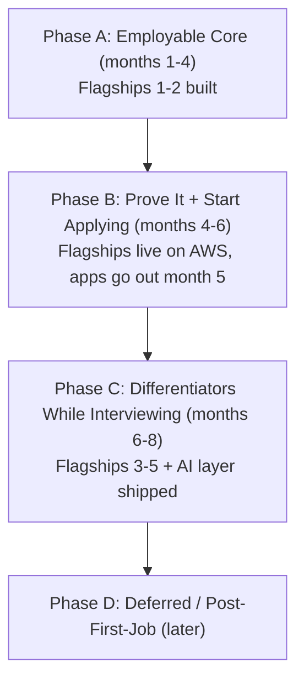

# Go Backend Path

> **Track:** Development · **Path:** Remote Go Backend Path (Go → AWS → Cloud/DevOps)
> 
> Complete curriculum, reconstructed July 2026 against live job-market data and merged with the instructor's SWE course. Modules 0–23 cover environment setup through job hunt, with learn-by-doing projects at each stage. **Module 12** merges a hands-on AWS course (VPC, EC2, RDS, IAM, CloudWatch, Route 53, S3, CloudFront, ECS, Lambda) with Go deploy projects for `jobtrackr` and the taka-flow platform. Five **flagship portfolio projects** (see [Flagship Portfolio Arc](#flagship-portfolio-arc-5-production-projects)) are threaded through the modules. The final **[Realistic Job Roadmap](#realistic-job-roadmap-sequencing--job-strategy)** section sequences everything into phases at **30 hrs/week over 8 months** and tells you when to start applying.

## At a glance

| Metric | Count |
|---|---|
| Modules | 24 (Modules 0–23) |
| Topics | 113 |
| Subtopics | ~502 |
| Projects | 50 (incl. 5 flagship portfolio projects + 3 AI feature projects) |
| Ongoing modules | 4 (Modules 18, 19, 21, 22) |
| Instructor course | Integrated per-module (📺 blocks); JS/Node-specific modules excluded |

## Market snapshot (July 2026) — why this path is shaped this way

| Finding | Consequence in this path |
|---|---|
| Go roles grew **~23% YoY**, concentrated in infrastructure, platform engineering, and **fintech** | Capstone is a fintech wallet/ledger platform; flagships lean infra-flavored (webhooks, monitoring) |
| **AWS in ~55%** of backend listings; cloud overall ~72% — cloud is table stakes | Module 12 stays a full hands-on AWS course; every flagship ships to real infrastructure |
| **Kubernetes in ~21%** of all roles, Docker ~12%, Terraform ~10% — DevOps demand is bolted onto backend jobs, not separate junior DevOps titles | Your "backend → cloud+DevOps" strategy is validated; K8s stays interview-level pre-job (M14), deep-dive post-offer |
| **~57% of Go jobs are remote/hybrid** — among the most remote-friendly languages | The remote-from-Bangladesh plan is realistic; M19/M23 build the async-communication proof |
| 2026 Go hiring stack: Go 1.22+, chi, **PostgreSQL + pgx/sqlc**, Redis, **gRPC** (microservices), Docker+K8s, **Prometheus + OpenTelemetry**, testify/testcontainers | This exact stack is what M1–M15 teach, in this order |
| Juniors get hired on **3–5 deployed systems with real metrics** (P95 latency, error rates, live URLs) — not many shallow repos | 5 flagship projects with k6 numbers, dashboards, and DECISIONS.md replace "quantity" |
| **SQL + HTTP/REST + Git + Docker ≈ 80% of junior posting requirements** | M0, M4, M5, M9 form the non-negotiable core, front-loaded |
| **AI literacy is now expected of backend engineers** — RAG in ~74% of LLM-focused roles; employers want "backend engineer first, AI systems builder second" (LLM APIs, tool calling, evals, cost control — **not** model training); hireable portfolios include 1–2 LLM-backed features | Module 17 rebuilt as a backend-first AI module; AI features added to flagships 1, 2 (`askvault` RAG) and the capstone; done in Phase C, **before** the offer — not deferred |

## Flagship Portfolio Arc (5 production projects)

The module micro-projects teach; these five **flagship projects** get you hired. Each solves a real problem, goes **live** with HTTPS, CI/CD, metrics + load-test numbers in the README, and an architecture diagram. Difficulty is strictly easy → hard:

| # | Flagship | Real problem it solves | Built during | Deployed |
|---|---|---|---|---|
| 1 | **`jobtrackr`** — Job Application Tracking API | Tracking your own job hunt (you'll use it in Phase B) | M4–M6 | M7 (VM) → M12 (AWS) |
| 2 | **`vaultdrop`** — File Sharing & Media Processing | Secure expiring file shares + async media pipeline | M9 (+S3 in M12) | M12 |
| 3 | **`hookrelay`** — Webhook Delivery Platform | Reliable event delivery with retries/DLQ (a real infra product category — think Svix) | M10 | M12–M13 |
| 4 | **`pulsewatch`** — Uptime Monitoring & Status Pages | 24/7 monitoring of your own portfolio — an unbeatable live interview demo | M11–M13 | M13 |
| 5 | **`taka-flow`** — Digital Wallet & Ledger Platform (capstone) | bKash/Nagad-style P2P wallet with a provably-correct double-entry ledger — fintech, where Go hiring concentrates | M16+, capstone milestones | M12–M13 (+K8s stretch M14) |

**AI layer (Module 17, Phase C):** three flagships gain LLM-backed features — `jobtrackr` (structured job-posting extraction + semantic search), `vaultdrop` → **`askvault`** (RAG document Q&A with citations — the RAG project 2026 portfolios are expected to contain), and `taka-flow` (tool-calling finance assistant with agent-safety guardrails). You stay a backend engineer; the AI is one well-engineered layer, not the identity.

## Instructor course integration (how to use it)

The instructor's SWE course is Node.js/Express/NestJS-based. The **concepts are universal**; the JS syntax collides with Go. Rules:

- **📺 Watch fully** (concept modules — marked per module below): webservers, API development, data modeling, all database/ERD modules, cookies/session, JWT, API security, CORS, pagination, PUT/PATCH/DELETE, file uploader, design patterns, load testing (k6), loggers. Watch → note the concept → **implement it in Go** → compare with his Node solution. This forced translation is what makes you stack-agnostic.
- **🔍 Skim for contrast only**: *JS with Node/Express*, *Async JS*, *JS Essentials*, *Process*, *TypeScript OOP*, *Interface & Polymorphism* — extract interview gold ("Node = single-threaded event loop; Go = goroutines multiplexed on OS threads"; "TS interfaces are explicit; Go's are implicit") and move on.
- **⛔ Skip hands-on-in-JS repetition**: don't rebuild his Express/NestJS code in JS. Exception: the **NestJS Project One** module — watch for the *process* (PRD → grooming → P0 tasks → layered modules), not the framework.
- **Bonus:** having watched the Node course, you can honestly list Node.js as a secondary skill — which covers the Bangladesh local-market keyword gap (see the Bangladesh note at the end) with zero extra build time.

## Table of contents

- [Module 0: Developer Environment & Foundations](#module-0-developer-environment-foundations)
- [Module 1: Go Language Fundamentals](#module-1-go-language-fundamentals)
- [Module 2: Concurrency in Go](#module-2-concurrency-in-go)
- [Module 3: Testing & Quality](#module-3-testing-quality)
- [Module 4: HTTP & REST API Development](#module-4-http-rest-api-development)
- [Module 5: Databases & Persistence](#module-5-databases-persistence)
- [Module 6: Authentication, Authorization & Security](#module-6-authentication-authorization-security)
- [Module 7: Linux (Deep)](#module-7-linux-deep)
- [Module 8: Networking](#module-8-networking)
- [Module 9: Containers & Local Orchestration](#module-9-containers-local-orchestration)
- [Module 10: Observability & Reliability](#module-10-observability-reliability)
- [Module 11: Debugging & Profiling](#module-11-debugging-profiling)
- [Module 12: Cloud & Deployment (AWS) — Hands-on](#module-12-cloud-deployment-aws--hands-on)
- [Module 13: CI/CD & Automation](#module-13-cicd-automation)
- [Module 14: Kubernetes (Interview-Level Only)](#module-14-kubernetes-interview-level-only)
- [Module 15: gRPC & Inter-Service Communication](#module-15-grpc-inter-service-communication)
- [Module 16: System Design & Architecture](#module-16-system-design-architecture)
- [Module 17: AI Integration — Backend-First](#module-17-ai-integration--backend-first-what-companies-actually-want)
- [Module 18: Reading Existing Code [Ongoing]](#module-18-reading-existing-code-ongoing) *(ongoing)*
- [Module 19: Communication & Remote Work [Ongoing]](#module-19-communication-remote-work-ongoing) *(ongoing)*
- [Module 20: API Documentation](#module-20-api-documentation)
- [Module 21: Open Source Contribution [Ongoing]](#module-21-open-source-contribution-ongoing) *(ongoing)*
- [Module 22: Engineering Mindset & Trade-offs [Ongoing]](#module-22-engineering-mindset-trade-offs-ongoing) *(ongoing)*
- [Module 23: Job Hunt & Interview Preparation](#module-23-job-hunt-interview-preparation)
- [Realistic Job Roadmap (sequencing & job strategy)](#realistic-job-roadmap-sequencing--job-strategy)

---

## Module 0: Developer Environment & Foundations

**Topics:** 4 · **Subtopics:** 25 · **Projects:** 2

### Topic 0.1: Computer & OS Basics

- CPU, RAM, disk, process, thread (conceptual)
- Client–server model
- Compiled vs interpreted (where Go fits)
- Editors vs IDEs (set up VS Code / Cursor)

### Topic 0.2: The Command Line (intro — deep Linux is Module 7)

- Navigation: `pwd`, `ls`, `cd`
- File ops: `mkdir`, `touch`, `cp`, `mv`, `rm`
- Viewing: `cat`, `less`, `head`, `tail`
- Pipes & redirection: `|`, `>`, `>>`, `<`
- Environment variables
- Searching: `grep`, `find`

### Topic 0.3: Git & GitHub

- What version control is and why
- `git init`, `git clone`
- Working dir → staging → commit
- `git add/commit/status/log/diff`
- Branches: `branch`, `switch`, `merge`
- Remotes: `push`, `pull`, `fetch`
- Pull requests & code review flow
- Merge conflicts and resolution
- `.gitignore`
- Commit hygiene
- Trunk-based vs GitFlow

### Topic 0.4: How the Web Works (conceptual; deep dive in Module 8)

- What a server is
- IP, ports, DNS (intro)
- Request/response cycle
- What an API is

### 📺 Instructor course — watch during Module 0

- **Welcome To Software Engineering Course** + **Setup Environment** — full watch (mindset, tools, Git/GitHub intro)
- **Introduction to webservers** (webserver definition, domain/IP, localhost, PORT + IP + server together, cloud systems) — full watch; where he builds a Node.js server, you rebuild it with Go `net/http` in Module 4
- **Introduction To Backend Systems** — full watch for the *why* of backend tooling; map "Node core modules" to Go stdlib packages

### Projects

#### Project: [Beginner] GitHub Profile & First Repo

*Tier: Beginner*

- Profile README with bio, stack, and pinned repos plan
- Public repo initialized with `.gitignore` and license
- Meaningful commit history with conventional messages
- LinkedIn/GitHub cross-linked for recruiter discovery

#### Project: [Beginner] Git Workflow Practice Repo

*Tier: Beginner*

- ≥10 commits across ≥2 branches
- One self-opened PR with description and review checklist
- Intentional merge conflict created and resolved
- Trunk-based or GitFlow workflow documented in README

---

## Module 1: Go Language Fundamentals

**Topics:** 9 · **Subtopics:** 48 · **Projects:** 3

### Topic 1.1: Getting Started

- Install Go, `go version`
- Modules: `go mod init`, `go.mod`, `go.sum`
- First program: `package main`, `func main()`
- Tooling: `go run/build/fmt/vet/test`

### Topic 1.2: Basic Syntax & Types

- Variables: `var`, `:=`, zero values
- Constants and `iota`
- Basic types: `int`, `float64`, `bool`, `string`, `byte`, `rune`
- Type conversion
- Operators
- Comments

### Topic 1.3: Control Flow

- `if`/`else`, `if` with init statement
- `for` (all forms)
- `switch` (expression, type, fallthrough)
- `break`, `continue`, labels
- `defer` (execution order)

### Topic 1.4: Composite Types

- Arrays
- Slices: `append`, `len`, `cap`, slicing, copy, backing array
- Maps: access, comma-ok, delete, iterate
- Strings: immutability, runes vs bytes, UTF-8, `strings`, `strconv`
- Structs: literals, embedding/composition
- Pointers: `&`, `*`, nil pointers

### Topic 1.5: Functions

- Params, returns, multiple returns, named returns
- Variadic functions
- First-class functions
- Closures
- Recursion

### Topic 1.6: Methods & Interfaces

- Value vs pointer receivers (and when to use each)
- Interfaces, implicit satisfaction
- Empty interface (`any`)
- Type assertions, type switches
- Common interfaces: `Stringer`, `error`, `io.Reader`, `io.Writer`
- Interface composition, polymorphism

### Topic 1.7: Error Handling

- The `error` type
- `errors.New`, `fmt.Errorf`, `%w` wrapping
- `errors.Is`, `errors.As`
- Sentinel and custom errors
- `panic` / `recover` (and when not to)
- Errors-as-values philosophy

### Topic 1.8: Packages & Project Structure

- Creating packages
- Exported vs unexported
- `import`, aliases
- `init()`
- Layout: `cmd/`, `internal/`, `pkg/`
- Doc comments / `go doc`

### Topic 1.9: Generics

- Type parameters `[T any]`
- Constraints (`comparable`, custom)
- Generic functions/types
- When generics help vs hurt

### 📺 Instructor course — skim during Module 1 (contrast material)

- **JS with Node & Express / Async JS / JS Essentials / Process** — 🔍 skim only. Extract the contrasts: callbacks & event loop vs goroutines & channels; `let/const` vs `var`/`:=`; `require/import` vs Go packages. These contrasts are frequent interview questions.
- **TypeScript with OOP / Interface & Polymorphism** — 🔍 skim when you reach Topic 1.6: TS interfaces are *explicit* (`implements`), Go interfaces are *implicit* (structural). His encapsulation/abstraction/inheritance lessons map to Go's exported/unexported identifiers, interfaces, and embedding (Go has no inheritance — composition instead; know why)

### Projects

#### Project: [Beginner] cli-todo

*Tier: Beginner*

- Add/list/complete/delete tasks via CLI flags or subcommands
- JSON or text file persistence between runs
- `go mod init`, tests with table-driven cases
- README with install, usage, and design notes

#### Project: [Beginner] unit-converter & word-counter

*Tier: Beginner*

- unit-converter: length/weight/temp with clear error messages
- word-counter: stdin/file input, line/word/char stats
- Both use `flag` or cobra; `go vet` and `go test` clean

#### Project: [Medium] Generic Stack[T] & Queue[T]

*Tier: Medium*

- Type-parameter stack with Push/Pop/Peek/Len
- Type-parameter queue with Enqueue/Dequeue
- Table-driven tests; benchmark Push/Pop vs slice-only baseline
- Short blog-style comment on when generics help vs hurt

---

## Module 2: Concurrency in Go

**Topics:** 5 · **Subtopics:** 24 · **Projects:** 3

### Topic 2.1: Goroutines

- Goroutine vs OS thread
- Launching with `go`
- The scheduler (conceptual)
- Goroutine leaks

### Topic 2.2: Channels

- Send/receive, unbuffered vs buffered
- Channel direction
- Closing, ranging
- `nil` channel behavior

### Topic 2.3: Synchronization

- `select`, `select` with `default`
- Timeouts with `time.After`
- `sync.WaitGroup`, `Mutex`, `RWMutex`, `Once`
- `sync/atomic`
- Race conditions + race detector (`-race`)

### Topic 2.4: context Package

- Why context exists
- `Background`, `TODO`
- `WithCancel`, `WithTimeout`, `WithDeadline`
- `WithValue` (and caveats)
- Propagation through call chains

### Topic 2.5: Concurrency Patterns

- Worker pool
- Fan-out / fan-in
- Pipelines
- Rate limiting (ticker, token bucket)
- Graceful shutdown (context + signals)
- `errgroup`

### Projects

#### Project: [Medium] concurrent-fetcher

*Tier: Medium*

- Fetch N URLs concurrently with worker pool
- Configurable concurrency limit and timeout per request
- Aggregate status codes, timings, and errors
- `go test -race` clean; document leak avoidance

#### Project: [Medium] rate-limiter library

*Tier: Medium*

- Token-bucket or sliding-window limiter package
- Examples: HTTP middleware + CLI demo
- Benchmarks; README with complexity and trade-offs

#### Project: [Advanced] parallel-file-processor

*Tier: Advanced*

- Walk directory; hash or transform files in parallel pipeline
- Graceful shutdown on SIGINT using context
- Fan-out/fan-in with errgroup; structured error reporting

---

## Module 3: Testing & Quality

**Topics:** 3 · **Subtopics:** 12 · **Projects:** 2

### Topic 3.1: Unit Testing

- `testing`, `*_test.go`
- `t.Error` vs `t.Fatal`
- Table-driven tests, subtests (`t.Run`)
- Coverage

### Topic 3.2: Advanced Testing

- `TestMain`, setup/teardown
- Mocking via interfaces + dependency injection
- `httptest`
- Integration tests with real DB
- Test containers (Postgres)
- Benchmarks, fuzzing, golden files

### Topic 3.3: TDD

- Red-green-refactor
- Testify (`assert`, `require`, `mock`)

### Projects

#### Project: [Medium] Test Suite Retrofit (prior projects)

*Tier: Medium*

- Add table-driven tests to cli-todo and concurrent-fetcher
- >70% coverage on concurrent-fetcher (report in README)
- Subtests for edge cases; `-coverprofile` artifact in repo

#### Project: [Beginner] Testify & Mock Exercise

*Tier: Beginner*

- Small service with interface + mock implementation (testify/mock)
- HTTP handler tested with httptest
- Document red-green-refactor cycle used on one feature

---

## Module 4: HTTP & REST API Development

**Topics:** 8 · **Subtopics:** 40 · **Projects:** 3

### Topic 4.1: HTTP Fundamentals

- Methods (GET/POST/PUT/PATCH/DELETE)
- Status codes (know common ones cold)
- Headers, body, content negotiation
- Idempotency & safety
- Cookies vs headers
- HTTPS/TLS (intro; deep in Module 8)

### Topic 4.2: net/http

- `http.Server`, `ListenAndServe`
- Handlers, `HandlerFunc`
- `ServeMux` + Go 1.22 routing (`GET /applications/{id}`)
- Reading params/body
- JSON responses (`encoding/json`)
- Server timeouts, graceful shutdown

### Topic 4.3: REST API Design

- REST principles, resources
- URL design & versioning
- Validation
- Consistent error responses
- Pagination, filtering, sorting
- Status-code selection

### Topic 4.4: Middleware

- Handler wrapping
- Logging, recovery, CORS
- Request/correlation ID
- Chaining

### Topic 4.5: Routers/Frameworks

- `chi` (in depth)
- `gin`, `echo` (awareness)
- Framework vs stdlib trade-offs

### Topic 4.6: Serialization

- JSON tags, custom marshaling
- Optional/unknown fields
- Protobuf (awareness)

### Topic 4.7: HTTP Clients & Consuming APIs

- `http.Client` (never use the default client with no timeout)
- Building requests: `http.NewRequestWithContext`, methods, query params
- Timeouts, context cancellation, connection reuse (keep-alive)
- Auth to third-party APIs: API keys, Bearer tokens, headers
- Parsing responses: status-code handling, decoding JSON, error bodies
- Retries with backoff and jitter; which requests are safe to retry
- Handling upstream pagination and rate limits (429 + `Retry-After`)

### Topic 4.8: Webhooks

- What webhooks are (inbound HTTP callbacks vs polling)
- Receiving and routing webhook events
- Signature verification (HMAC shared secret) and replay protection
- Idempotency and deduplication via event IDs
- Respond fast (2xx) then process async (hand off to a worker/queue)
- Retries and out-of-order delivery from providers

### 📺 Instructor course — watch during Module 4 (core concept modules)

- **API Development Part One** (status codes, routing, POST anatomy, data flow, validation) — full watch; do his "One API" assignment in Go
- **API Development Part Two** (routers, controllers, middleware, rate-limiting middleware, audit logger) — full watch; implement the audit-logger and rate-limiter as Go middleware in `jobtrackr` (Topic 4.4)
- **Data Modeling Part One** (JSON modeling, API design approach, e-commerce product API design) — full watch; do the e-commerce API design exercise with Go structs + JSON tags (Topic 4.6)
- **Beyond CRUD: PUT/PATCH/DELETE** (PUT vs PATCH, soft vs hard delete, bulk updates, ETag) — full watch, incl. all three interview-question sets
- **Response Formatting & Pagination** (response envelopes, offset vs cursor, benchmarking) — full watch; replicate his offset-vs-cursor benchmark in Go on `jobtrackr` and publish the numbers
- **API Security: CORS** (definition, hands-on, simulation) — full watch; run his CORS simulation against your own Go API

### Projects

#### Project: [Beginner] jobtrackr-inmemory — 🚩 Flagship 1 begins

*Tier: Beginner*

> `jobtrackr` is Flagship Project 1: a Job Application Tracking API you will actually use during your own job hunt (companies, applications, interview stages, notes, reminders). It grows with you: in-memory here → Postgres/Redis (M5) → auth/RBAC (M6) → deployed on a VM (M7) → AWS (M12).

- CRUD REST API for companies, applications, and interview stages (in-memory store)
- JSON request/response; consistent error envelope
- Logging + recovery middleware; httptest for handlers
- Chi or stdlib ServeMux with Go 1.22 routing

#### Project: [Medium] REST API Hardening Pass

*Tier: Medium*

- Pagination (offset **and** cursor, benchmarked like the instructor's lesson), filtering, validation on jobtrackr-inmemory
- Request ID middleware; CORS configured correctly
- Rate-limiting + audit-logger middleware (instructor's Module: API Development Part Two, in Go)
- OpenAPI-style endpoint table in README

#### Project: [Medium] API Client + Inbound Webhook Handler

*Tier: Medium*

- Consume a real third-party API with a timeout-configured `http.Client`
- Context cancellation + retry with backoff on 5xx/429
- Inbound webhook endpoint with HMAC signature verification
- Idempotent event handling (dedupe by event ID); fast 2xx then async process
- Tests with `httptest` for both the client (mock server) and webhook receiver

---

## Module 5: Databases & Persistence

**Topics:** 6 · **Subtopics:** 34 · **Projects:** 2

### Topic 5.1: Relational Fundamentals

- Tables, rows, columns, types
- Keys, relationships (1-1, 1-many, many-many)
- Normalization (1NF–3NF), when to denormalize
- ER modeling

### Topic 5.2: SQL

- `SELECT/WHERE/ORDER BY/LIMIT/OFFSET`
- `INSERT/UPDATE/DELETE`
- JOINs, `GROUP BY`, `HAVING`, aggregates
- Subqueries, CTEs
- Indexes (types, cost)
- `EXPLAIN` / query plans

### Topic 5.3: PostgreSQL

- Running locally + Docker, `psql`
- Types (`jsonb`, arrays, `uuid`, timestamptz)
- Constraints, sequences
- Transactions, ACID, isolation levels
- Row locking (`FOR UPDATE`), deadlocks
- Connection pooling
- Postgres vs MySQL (trade-offs)

### Topic 5.4: Go + Database

- `database/sql`, drivers (`pgx`/`lib/pq`)
- `QueryRow/Query/Exec`, scanning, `ErrNoRows`
- Prepared statements, SQL injection prevention
- Transactions in Go (`defer` rollback)
- Pool tuning
- `sqlc`, GORM (trade-offs)

### Topic 5.5: Migrations

- Why migrations exist
- `golang-migrate` up/down
- Versioning + running in CI/deploy

### Topic 5.6: Redis & Caching

- In-memory KV store
- Data types (string, hash, list, set, zset)
- TTL/expiration
- Use cases: cache, sessions, rate limit, queues
- Cache-aside, write-through
- Invalidation problems
- `go-redis`
- Redis vs querying Postgres (trade-offs)

### 📺 Instructor course — watch during Module 5 (stack-agnostic; his strongest section)

- **Introduction to Database** + **Database Schema and SQL Introduction** — full watch (design-thinking approach, altering live tables, generating fake data with loops)
- **Database Read Query Fundamentals** (SELECT/WHERE/GROUP BY/ORDER BY complex queries) — full watch; SQL transfers 1:1
- **Database Fundamentals: Entity Relationship** (1-many/many-many, subqueries & joins, normalization 1NF→3NF, candidate/primary/composite keys) — full watch, it's excellent; his normalization Q&A sections are interview prep
- **ERD Basics** (e-commerce ERD + blogpost ERD homework) — full watch; do both ERD exercises, they feed the E-commerce Schema Design project below

### Projects

#### Project: [Medium] jobtrackr (Postgres + Redis)

*Tier: Medium*

- Postgres schema with migrations (golang-migrate)
- CRUD via database/sql or pgx; connection pool tuned
- Redis cache-aside for hot reads or session store
- docker-compose for local dev; integration tests

#### Project: [Advanced] E-commerce Schema Design

*Tier: Advanced*

- ER diagram: users, products, orders, order_items, inventory
- Normalization notes + intentional denormalization choices
- Sample SQL: JOINs, aggregates, index recommendations
- DECISIONS.md with Postgres vs MySQL rationale

---

## Module 6: Authentication, Authorization & Security

**Topics:** 3 · **Subtopics:** 17 · **Projects:** 2

### Topic 6.1: Authentication

- bcrypt hashing, salt, cost
- Session-based auth (cookies)
- JWT structure, signing (HS256/RS256)
- Access vs refresh tokens
- Expiry & revocation (Redis blocklist)
- JWT vs sessions (trade-offs)

### Topic 6.2: Authorization

- AuthN vs AuthZ
- RBAC
- Ownership checks
- Permissions/scopes
- Middleware-based authz

### Topic 6.3: Web Security Essentials

- OWASP Top 10 (awareness)
- SQL injection, XSS, CSRF
- Input validation/sanitization
- Rate limiting / brute-force protection
- Secrets management
- HTTPS/TLS, secure headers, CORS done right

### 📺 Instructor course — watch during Module 6 (auth & security core)

- **Cookies and Session** (stateless HTTP, cookie-based login, custom session storage, session vs cookie, problems with cookie auth) — full watch; build the cookie/session flow in Go before touching JWT so you feel *why* JWT exists
- **JWT** (first module) + **Authentication & Authorization with JWT In Details** (base64/encoding vs encryption, signatures, hashing + salting, production-grade JWT, RBAC, private/public key signing) — full watch; his "production grade JWT setup" maps directly to the Secure jobtrackr project below
- **API Security** (SQL injection root-cause + simulation, parameterized queries, XSS, CSP headers, HttpOnly cookies, CSRF tokens) — full watch; run his SQLi attack simulation against your own Go API (pgx parameterized queries defend it), then complete his **SQL Injection Interview Question Bank**
- His JWT to-do-manager assignment (no database) — do it in Go as a warm-up

### Projects

#### Project: [Medium] Secure jobtrackr (JWT + RBAC)

*Tier: Medium*

- bcrypt password hashing; register/login endpoints
- JWT access + refresh tokens; rotation strategy documented
- RBAC: admin / editor / viewer roles on application resources
- Login rate limiting; Redis blocklist for revoked tokens

#### Project: [Advanced] Security Hardening Checklist

*Tier: Advanced*

- Input validation on all write endpoints
- Security headers middleware; HTTPS-only cookies if session used
- OWASP Top 10 self-audit checklist filled for jobtrackr

---

## Module 7: Linux (Deep)

**Topics:** 8 · **Subtopics:** 24 · **Projects:** 2

### Topic 7.1: Core Linux

- Filesystem hierarchy
- Permissions (`chmod`, `chown`, rwx, octal)
- Users, groups, `sudo`
- Package manager (`apt`)
- Set up WSL or a free-tier Linux VM

### Topic 7.2: Processes & Files

- Processes: `ps`, `top`/`htop`, `kill`, signals (SIGTERM/SIGINT/SIGKILL)
- File descriptors (stdin/stdout/stderr, limits, `lsof`)
- Redirection deep dive

### Topic 7.3: Services & Scheduling

- systemd / systemctl (writing a unit file to run your Go service)
- journalctl (reading service logs)
- cron (scheduled jobs)

### Topic 7.4: Editors & Multiplexers

- vim basics (modes, edit, save/quit, search/replace)
- tmux (sessions, windows, panes — essential for SSH work)

### Topic 7.5: Networking & Remote Access

- ssh + ssh-agent + key management
- `scp`, `rsync`
- curl mastery (methods, headers, data, auth, following redirects, timing)
- `jq` for parsing/filtering JSON responses on the command line
- `wget`, `netstat`/`ss`, `ping`

### Topic 7.6: Web Server / Proxy

- nginx config (server blocks, reverse proxy to your Go app, TLS, static files)

### Topic 7.7: Archiving & Compression

- tar
- gzip
- `zip`/`unzip`

### Topic 7.8: Shell Scripting

- Variables, conditionals, loops
- Writing deploy/util scripts

### Projects

#### Project: [Advanced] jobtrackr on Linux VM

*Tier: Advanced*

- Deploy jobtrackr on WSL or free-tier Linux VM
- systemd unit file; service survives reboot
- nginx reverse proxy with TLS (self-signed or Let's Encrypt)
- Bash deploy script: build, migrate, restart, health check

#### Project: [Medium] Linux Ops Runbook

*Tier: Medium*

- Document: permissions fix, log locations, restart procedure
- journalctl queries for debugging 5xx errors
- tmux session recipe for long-running dev on SSH

---

## Module 8: Networking

**Topics:** 5 · **Subtopics:** 13 · **Projects:** 2

### Topic 8.1: The Stack

- OSI/TCP-IP layers (conceptual)
- TCP vs UDP (when each is used)
- NAT (private vs public IPs, port forwarding)

### Topic 8.2: Naming & Security

- DNS (records, resolution, caching)
- TLS handshake (certificates, SNI, what actually happens)

### Topic 8.3: HTTP in Depth

- HTTP/1.1 (connections, methods, headers)
- Keep-Alive and connection reuse
- HTTP/2 (multiplexing, vs HTTP/1.1)
- Status codes & caching headers

### Topic 8.4: Delivery & Routing

- Reverse proxy (concept + nginx)
- Load balancers (L4 vs L7, algorithms)

### Topic 8.5: Real-time & RPC Transport

- WebSockets (handshake, use cases)
- gRPC transport (HTTP/2 based — connects to Module 15)

### Projects

#### Project: [Medium] Network Labs Bundle

*Tier: Medium*

- Inspect TLS handshake with `openssl s_client` (notes in repo)
- Tiny WebSocket echo server in Go
- nginx L7 load balancer over 2 app instances
- Diagram: request path client → nginx → app → DB

#### Project: [Medium] url-shortener

*Tier: Medium*

- Short-code generation; redirect endpoint
- Postgres persistence; collision handling
- Rate limit creation endpoint; analytics optional
- Second pinned repo quality README + live demo optional

---

## Module 9: Containers & Local Orchestration

**Topics:** 2 · **Subtopics:** 14 · **Projects:** 3

### Topic 9.1: Docker

- Containers vs VMs
- Images vs containers
- Dockerfile: `FROM/WORKDIR/COPY/RUN/CMD/ENTRYPOINT/EXPOSE`
- Building, tags
- Running: ports, volumes, env
- Multi-stage builds (static Go binaries)
- `.dockerignore`, layers & caching
- `docker exec` / shell into containers; logs & debugging
- Publish images to a registry (Docker Hub / GHCR / ECR) with `docker push`
- Why containerize (trade-offs)

### Topic 9.2: Docker Compose

- `docker-compose.yml`
- Multi-service (app + Postgres + Redis)
- Networks, volumes, health checks
- `depends_on` / startup ordering

### 📺 Instructor course — watch during Module 9 (feeds Flagship 2)

- **File Uploader Project** (multipart uploads, MIME types, multer & alternatives, how HTTP handles file upload client→server, third-party/DigitalOcean object storage, upload SLA + rate limiting) — full watch, incl. interview questions. His Node/multer implementation becomes your Go implementation in `vaultdrop` below; his "DigitalOcean Spaces" becomes MinIO locally, then S3 in Module 12

### Projects

#### Project: [Advanced] Full Docker Compose Stack

*Tier: Advanced*

- Multi-stage Dockerfile (static Go binary)
- compose: app + Postgres + Redis + healthchecks
- Volumes for data; `.dockerignore` optimized for layer cache
- Tag and push the image to a registry (Docker Hub / GHCR)
- One-command `docker compose up` documented

#### Project: [Medium→Advanced] 🚩 Flagship 2 — `vaultdrop` (File Sharing & Media Processing Service)

*Tier: Medium→Advanced*

> Extends the instructor's File Uploader project to production level, in Go. Real problem: secure, expiring file sharing with async processing.

- Multipart upload handling → MIME validation → object storage (MinIO via compose now; S3 + presigned URLs in M12)
- Goroutine **worker pool** for async processing: thumbnails/resize, checksums (applies Module 2 for real)
- Expiring share links, download counters, per-user quotas, upload rate limiting + SLA (instructor's SLA lesson)
- Redis for hot metadata cache + rate limiter backing
- Full compose stack (app + Postgres + Redis + MinIO); multi-stage Dockerfile
- k6 load test (P95/P99 in README) — first use of instructor's Load Testing module

#### Project: [Capstone] Capstone Milestone — Containerize Platform

*Tier: Capstone*

- taka-flow capstone app containerized with compose (when the capstone MVP starts in Phase B, apply this milestone)
- All services networked; secrets via env files (not committed)
- Smoke test script run in CI

---

## Module 10: Observability & Reliability

**Topics:** 4 · **Subtopics:** 19 · **Projects:** 3

### Topic 10.1: Logging

- Structured logging (`slog`)
- Levels, correlation IDs
- What not to log (secrets/PII)
- Log storage & routing: console, files, syslog; rotation for long-running services
- Log security: PII filtering/obfuscation, safe error-response logging, encryption at rest

### Topic 10.2: Metrics & Monitoring

- Counter, gauge, histogram
- Prometheus + `/metrics`
- Instrumenting Go
- Grafana (awareness)
- Four golden signals

### Topic 10.3: Tracing & Health

- Distributed tracing concepts: spans, trace IDs, context propagation
- OpenTelemetry SDK in Go: instrument HTTP handlers and outbound calls
- Export traces to Jaeger; read a trace to find the latency bottleneck
- `/healthz`, `/readyz`
- Graceful degradation

### Topic 10.4: Background Workers & Queues

- Why background jobs
- In-process workers
- Redis-backed queues (`asynq`)
- Retries, idempotency, dead-letter

### 📺 Instructor course — watch during Module 10

- **Loggers** (logger system architecture, problems with console.log, Winston vs Pino comparative study) — full watch; his Winston/Pino concepts (levels, transports, structured output, performance) map to `slog`/zap in Go — write the mapping in your notes
- (His **Load Testing with K6** module is scheduled in Module 11 — peek ahead if you finish early)

### Projects

#### Project: [Medium] Observability Upgrade (jobtrackr or capstone)

*Tier: Medium*

- Structured logging with `slog` + correlation IDs; PII obfuscation on sensitive fields
- Prometheus `/metrics` (latency, errors, in-flight)
- Distributed tracing with OpenTelemetry exported to Jaeger (one request traced end-to-end)
- Background email/job worker with retries + dead-letter note
- `/healthz` and `/readyz` endpoints

#### Project: [Advanced] 🚩 Flagship 3 — `hookrelay` (Webhook Delivery Platform)

*Tier: Advanced*

> A genuine infrastructure product category (companies like Svix charge for this). Combines M4's webhook topic with this module's queues/workers. Deeply Go, deeply impressive.

- Accept events via API → durably queue → deliver to subscriber URLs with **retries + exponential backoff + jitter, dead-letter queue, HMAC signatures, idempotency keys**
- Postgres as durable queue first (`FOR UPDATE SKIP LOCKED`), then swap in Redis Streams/asynq — document the trade-off in DECISIONS.md
- Delivery dashboard endpoints: attempt logs, success rates, latency percentiles
- Full observability: `slog` + Prometheus (deliveries/sec, retry count, DLQ depth) + Grafana dashboard screenshot in README
- Deploys to AWS with CI/CD in M12–M13

#### Project: [Capstone] Capstone Milestone — Metrics Dashboard

*Tier: Capstone*

- Prometheus metrics on capstone; Grafana screenshot or config
- Alert-worthy SLO defined (e.g. p99 latency, error rate)

---

## Module 11: Debugging & Profiling

**Topics:** 4 · **Subtopics:** 18 · **Projects:** 2

### Topic 11.1: Debugging

- Delve (Go debugger): breakpoints, stepping, inspecting variables
- Stack traces: reading them
- Panic analysis: interpreting panic output
- Goroutine dumps (`SIGQUIT`, full goroutine stack)

### Topic 11.2: Profiling with pprof

- CPU profile
- Heap / memory profile
- Goroutine profile
- Memory profiling for leaks
- Capturing via `net/http/pprof`
- Visualizing (`go tool pprof`, flame graphs)

### Topic 11.3: Finding Bottlenecks

- Benchmark + profile workflow
- Identifying hot paths
- Common Go performance pitfalls (allocations, copying)

### Topic 11.4: Load Testing (k6)

- Latency fundamentals: P50/P95/P99, why averages lie
- k6 scripts: virtual users, stages, thresholds
- Load vs stress vs soak testing
- Finding your service's breaking point, then profiling the bottleneck (ties 11.2 + 11.3 together)
- Publishing honest numbers in READMEs ("sustains X req/s at P95 < Y ms on Z hardware")

### 📺 Instructor course — watch during Module 11

- **Load Testing** (system latency fundamentals, P95/P99, k6 hands-on, performance testing with Postman) — full watch; then load-test **every flagship** and put the numbers in each README. This module + pprof is your "performance story" for interviews

### Projects

#### Project: [Advanced] pprof Bottleneck Hunt & Fix

*Tier: Advanced*

- Introduce deliberate CPU or alloc hotspot in a service
- Capture CPU + heap profiles via net/http/pprof
- Flame graph or `go tool pprof` analysis in docs
- Before/after benchmark numbers after fix

#### Project: [Beginner] Delve Debugging Exercise

*Tier: Beginner*

- Reproduce bug; fix using Delve breakpoints
- Document panic stack trace reading steps
- Goroutine dump analysis write-up (SIGQUIT)

---

## Module 12: Cloud & Deployment (AWS) — Hands-on

**Topics:** 13 · **Subtopics:** 63 · **Projects:** 4

> **How this module works:** Learn AWS from the ground up by building real infrastructure yourself, then apply every chapter to **your** Go apps (`jobtrackr`, taka-flow platform). Order matters: Cloud → VPC → IAM → compute/data → delivery → containers → serverless (optional) → IaC awareness. Complete M7–M9 (Linux, networking, Docker) before this module.

### Topic 12.1: Cloud Computing

- IaaS / PaaS / SaaS and where AWS fits
- AWS accounts, Free Tier, and billing alerts
- Regions, availability zones, and latency trade-offs
- Shared responsibility model
- Cost models: on-demand vs reserved vs spot (awareness)
- Cost traps for beginners (idle EC2, public data transfer, NAT Gateway)

### Topic 12.2: Networking — VPCs

- VPC, CIDR blocks, and isolation
- Public vs private subnets
- Route tables, Internet Gateway, NAT Gateway (when you need it)
- Security groups vs network ACLs (conceptual)
- Why apps sit in private subnets behind a public load balancer
- Building a VPC suitable for a secure app deployment
- Diagram: client → ALB → app subnet → RDS subnet

### Topic 12.3: IAM — Identity and Access Management

- Root account hygiene (MFA; never use root for daily work)
- IAM users, groups, roles, and policies
- Least-privilege policies for deployed apps
- Instance / task roles vs long-lived access keys
- Cross-service access patterns (ECS → S3, Lambda → RDS)
- Documenting who can do what in your project README

### Topic 12.4: EC2 — Elastic Compute Cloud

- AMIs, instance types, key pairs
- Launching and connecting via SSH (ties to M7)
- Security groups as instance firewalls
- User data / bootstrap scripts for Go binaries
- Elastic IPs and when not to use them
- Scaling concepts (manual → ASG awareness)
- Production workflow: build → deploy → health check → rollback

### Topic 12.5: RDS — Relational Database Service

- Managed PostgreSQL on RDS (matches M5)
- Instance sizing, storage, and Multi-AZ (awareness)
- Automated backups and restore basics
- Security: private subnet, security groups, no public DB
- Connecting a Go app (`database/sql` / pgx) to RDS
- Parameter groups and connection limits (awareness)

### Topic 12.6: Monitoring — CloudWatch

- Metrics, logs, and alarms
- Shipping application logs from EC2/ECS
- Alerts for CPU, 5xx, and disk/memory (where available)
- Dashboards for a healthy production system
- Ties to M10 (Prometheus locally vs CloudWatch on AWS)

### Topic 12.7: DNS — Route 53

- Hosted zones and common record types (A, CNAME, ALIAS)
- Pointing a domain at ALB or CloudFront
- Health checks and simple failover (awareness)
- Reliable user access to apps hosted on AWS

### Topic 12.8: S3 — Simple Storage Service

- Buckets, objects, prefixes, and regions
- Object permissions and bucket policies
- Block Public Access and least-privilege access
- Production patterns: app uploads, static assets, backups
- Capstone use case: file uploads / report exports

### Topic 12.9: CDN — CloudFront

- Why a CDN (latency, caching, TLS at the edge)
- CloudFront in front of S3 and/or ALB
- Cache behaviors and invalidation basics
- Speeding up global delivery of static assets and APIs (where appropriate)

### Topic 12.10: ECS — Elastic Container Service

- Containers on AWS without deep Kubernetes (ties to M9)
- ECR: build, tag, push Go images
- Task definitions, services, and desired count
- ECS on EC2 vs **Fargate** (choose one primary path; know both)
- Application Load Balancer (ALB) in front of ECS services
- Health checks, rolling updates, and scaling services
- ECS vs EKS (talking level — deep K8s waits for M14 / on the job)
- ElastiCache (managed Redis) — awareness for cache/rate-limit in prod

### Topic 12.11: Serverless Functions — Lambda

- When Lambda fits vs always-on ECS (trade-offs)
- Deploying a Go or managed-runtime function
- API Gateway → Lambda for small production APIs
- Triggers, timeouts, cold starts (awareness)
- IAM roles for Lambda; CloudWatch logs
- Optional for first junior backend role — do after ECS is solid

### Topic 12.12: Delivery & TLS Extras

- Reverse proxy with nginx on EC2 (ties to M7 / M8)
- TLS certificates with ACM
- HTTPS end-to-end: Route 53 → CloudFront/ALB → service
- Comparing nginx-on-EC2 vs ALB+ECS for your apps

### Topic 12.13: Infrastructure as Code (awareness)

- What IaC is and why click-ops does not scale
- Terraform basics (resources, state — awareness)
- CloudFormation (awareness)
- Goal: be able to discuss IaC in interviews; automate later in M13

### Projects

#### Project: [Medium] VPC + IAM Lab

*Tier: Medium*

- Build a VPC with public and private subnets, route tables, and internet access
- Create least-privilege IAM roles/policies for a future app deploy
- Document the network diagram and cost notes (NAT vs public-only lab)
- No production secrets in the repo; use IAM roles, not committed keys

#### Project: [Advanced] Deploy the flagships to AWS (jobtrackr → vaultdrop → hookrelay)

*Tier: Advanced*

- Preferred path: **ECS Fargate + ECR + ALB + RDS Postgres** (or EC2 + compose if cost-constrained)
- `jobtrackr` live on a public HTTPS URL (ACM) — Flagship 1 goes to AWS
- `vaultdrop` upgraded from MinIO to **S3 with presigned URLs** + least-privilege task role — Flagship 2 live
- `hookrelay` deployed with CloudWatch logs + alarms on DLQ depth/5xx — Flagship 3 live (CI/CD completes in M13)
- IAM least-privilege roles documented per service
- Optional: Route 53 custom domain; CloudFront in front of static assets

#### Project: [Advanced] Lambda Stretch (optional)

*Tier: Advanced*

- One small API via API Gateway + Lambda (health check, webhook, or report trigger)
- CloudWatch logs; IAM role with least privilege
- Short DECISIONS.md: why this is Lambda vs part of the ECS service

#### Project: [Capstone] Capstone Milestone — AWS Production

*Tier: Capstone*

- taka-flow platform deployed with HTTPS on custom or AWS domain
- VPC-aware layout: ALB public, app + RDS private where practical
- RDS Postgres + optional ElastiCache/Redis
- S3 for file uploads / reports; CloudWatch monitoring
- Runbook: deploy, rollback, scale, and estimated monthly cost

### Suggested chapter order (merge of course + path)

```
12.1 Cloud Computing
  → 12.2 VPCs
  → 12.3 IAM
  → 12.4 EC2
  → 12.5 RDS
  → 12.6 CloudWatch
  → 12.8 S3
  → 12.7 Route 53
  → 12.12 ACM / nginx extras
  → 12.10 ECS (+ ECR + ALB)   ← primary deploy path for Go containers
  → 12.9 CloudFront
  → 12.11 Lambda (optional)
  → 12.13 IaC awareness
  → then Module 13 (CI/CD into AWS)
```

---


## Module 13: CI/CD & Automation

**Topics:** 6 · **Subtopics:** 23 · **Projects:** 3

### Topic 13.1: Concepts

- CI vs CD (delivery vs deployment)
- Pipeline stages: build → test → lint → security scan → package → deploy

### Topic 13.2: GitHub Actions

- Workflow YAML, triggers, jobs, steps, runners
- Caching deps
- `go test/vet`, linters
- Build + push Docker image
- Secrets in CI
- Deploy step to AWS

### Topic 13.3: Deployment Strategies

- Rolling deployments
- Blue-green deployments
- Feature flags
- Rollbacks

### Topic 13.4: Secrets Management

- Env-based secrets
- AWS Secrets Manager / SSM Parameter Store
- Never commit secrets; rotation basics

### Topic 13.5: Code Quality Automation

- `golangci-lint`
- `gofmt`/`goimports` checks
- Pre-commit hooks

### Topic 13.6: Security in CI

- `govulncheck` (known vulnerabilities in dependencies and the stdlib)
- `gosec` static analysis (SAST) for common Go security issues
- Dependency scanning and automated updates (Dependabot)
- Secret scanning to block committed credentials
- Fail the build on high-severity findings; triage and suppression workflow

### Projects

#### Project: [Advanced] Full GitHub Actions Pipeline

*Tier: Advanced*

- Workflow: test → lint (golangci-lint) → security scan (govulncheck + gosec) → build image → deploy
- Cache Go modules; matrix or single job documented
- Dependabot enabled; build fails on high-severity vulnerabilities
- Secrets from GitHub/SSM; no keys in repo
- Rolling or blue-green deploy strategy noted

#### Project: [Advanced] 🚩 Flagship 4 — `pulsewatch` (Uptime Monitoring & Status Page Platform)

*Tier: Advanced*

> Your concurrency + ops showpiece (an UptimeRobot/BetterStack-style product). It monitors your other three live flagships 24/7 — a live status page of your own portfolio is an unbeatable interview demo.

- Scheduler running **thousands of concurrent HTTP/TCP checks** via goroutine pools; per-check intervals and timeouts (Module 2 at full power)
- Incident detection (N consecutive failures) + alerting via email/Telegram
- Public status pages with uptime history and latency graphs (Go templates + htmx — enough UI to demo, no frontend rabbit hole)
- Time-series storage strategy in Postgres (partitioning/aggregation) — write up the design in DECISIONS.md
- Soak test: how many checks/minute can one node sustain? Publish the number (Module 11 skills)
- Ships with the full toolkit: Docker, GitHub Actions CI/CD with security scans, AWS deploy, Prometheus/Grafana, tracing

#### Project: [Capstone] Capstone Milestone — CI/CD Complete

*Tier: Capstone*

- Capstone pipeline green on main; deploy on tag or merge
- Pre-commit hooks locally mirroring CI checks
- Badges in README: build, coverage, deploy status

---

## Module 14: Kubernetes (Interview-Level Only)

**Topics:** 2 · **Subtopics:** 7 · **Projects:** 1

### Topic 14.1: Core Concepts

- Pods
- Deployments
- Services
- Ingress

### Topic 14.2: Talking Points

- Why orchestration exists
- ECS vs EKS (revisit)
- What you'd learn next professionally

### Projects

#### Project: [Beginner] K8s Local Stretch (kind/minikube)

*Tier: Beginner*

- Deployment + Service + Ingress for capstone or jobtrackr
- Local image load or registry push documented
- Talking points doc: Pods vs Deployments vs Services

---

## Module 15: gRPC & Inter-Service Communication

**Topics:** 2 · **Subtopics:** 6 · **Projects:** 1

### Topic 15.1: Protocol Buffers

- `.proto`, messages, services
- Code generation (`protoc`)

### Topic 15.2: gRPC in Go

- Unary RPCs
- Streaming (awareness)
- gRPC vs REST (trade-offs)
- Interceptors

### Projects

#### Project: [Advanced] Internal gRPC Service (capstone)

*Tier: Advanced*

- `.proto` definition + generated Go stubs
- Unary RPC integrated into capstone (e.g. internal balance/ledger lookup service)
- Interceptor for logging/auth; gRPC vs REST trade-off in DECISIONS.md

---

## Module 16: System Design & Architecture

**Topics:** 4 · **Subtopics:** 16 · **Projects:** 2

### Topic 16.1: Architecture Patterns

- Layered (handler → service → store)
- Clean architecture / dependency direction
- Monolith vs microservices (junior-scale trade-offs)
- Dependency injection (manual, idiomatic)

### Topic 16.2: Scalability

- Stateless services + horizontal scaling
- Caching layers
- Read replicas (awareness)
- Load balancing
- Queues for decoupling

### Topic 16.3: Reliability & Failure

- Behavior under heavy load
- Timeouts, retries, circuit breakers (awareness)
- Idempotency keys
- Graceful shutdown / zero-downtime deploys

### Topic 16.4: Design Practice

- URL shortener
- Rate limiter
- Concurrency-safe wallet/ledger system (feeds the capstone: no money created or destroyed, ever)

### 📺 Instructor course — watch during Module 16

- **Software Design Patterns** (Singleton, DI, Factory, Strategy, Decorator + all interview-question sets) — full watch; implement each in **idiomatic Go**: DI = constructor injection with interfaces, Strategy = interface implementations, Decorator = handler wrapping/middleware, Singleton = `sync.Once` (and why package-level vars are usually enough). Answer every interview question with a Go example
- **NestJS + NestJS Project One** — ⛔ skip the framework hands-on; 📺 watch the *process* lessons (requirement analysis, PRD, technical grooming, finding P0 tasks, DTO/repository/service/controller layering). Mirror that layering (handler → service → store) and that PRD-first workflow in the taka-flow capstone — this is how real teams work, and it shows in interviews

### Projects

#### Project: [Medium] System Design Exercise Pack

*Tier: Medium*

- URL shortener: API + storage + scale notes (extend M8 project)
- Rate limiter design doc: token bucket at edge vs app
- Concurrency-safe wallet/ledger: idempotency + locking strategy (direct capstone prep)
- One-page diagrams per problem (Excalidraw or Mermaid in repo)

#### Project: [Capstone] Capstone Architecture RFC

*Tier: Capstone*

- RFC: layered handler → service → store for taka-flow platform
- Monolith vs microservices decision with junior-scale rationale
- Failure modes: DB down, queue backlog, 10k RPS sketch

---

## Module 17: AI Integration — Backend-First (what companies actually want)

**Topics:** 6 · **Subtopics:** 30 · **Projects:** 3

> **Positioning (July 2026 market data):** You are not becoming an AI engineer — you are a **backend engineer who can ship LLM-backed features safely in production**. Job-description analysis shows AI-adjacent roles are backend-driven (~half explicitly require backend skills); what employers list is **RAG (~74% of LLM-focused roles), LLM API integration, tool/function calling with strict JSON schemas, evals, and cost/latency control** — not model training (fine-tuning appears in under 10%). One real job post says it best: *"LLMs are probabilistic components that must be engineered carefully inside reliable backend systems. This is a systems engineering role, not just prompt engineering."* That's your existing skill set + one new layer. The hireable 2026 junior portfolio includes **1–2 LLM-backed features built end-to-end** — this module produces them.
>
> The instructor's course has no AI module — this fills that gap. Everything here reuses skills you already built: HTTP clients with retries (M4.7), Postgres (M5 — pgvector is just an extension), workers/queues (M10), observability (M10), security thinking (M6).

### Topic 17.1: LLM APIs from Go (the plumbing)

- Calling LLM APIs from Go (OpenAI/Anthropic-style; provider-agnostic client design behind an interface — vendor abstraction is a listed job requirement)
- Streaming responses (SSE) end-to-end: provider → your Go service → client
- Tokens: what they are, context-window limits, counting/estimating
- Cost & latency engineering: caching identical/similar requests, model tiering (cheap model first), timeouts + retries with backoff (your M4.7 skills apply directly)
- Rate limits (429 + `Retry-After`), graceful degradation and fallbacks when the model is down
- AWS Bedrock awareness (managed LLMs — ties to M12; commonly listed alongside OpenAI/Anthropic)

### Topic 17.2: Prompt Engineering & Structured Output

- System vs user messages; few-shot examples; when chain-of-thought helps
- **Structured output**: strict JSON schema constraints, parsing into Go structs, validate-and-repair loops when the model returns garbage
- Prompt templates as versioned artifacts (in git, like migrations — prompt versioning is a listed job skill)
- Context-window management: fitting retrieved content in intelligently, not stuffing

### Topic 17.3: Embeddings & RAG (the #1 asked-for skill)

- Embeddings: what they are, choosing a model, generating them in a pipeline (background workers — M10 skills)
- **pgvector**: vector columns in the Postgres you already run; ANN indexes (HNSW/IVFFlat awareness)
- Chunking strategies: fixed-size vs semantic; why bad chunking is the most common RAG failure
- The full RAG pipeline: ingest → chunk → embed → store → retrieve → rerank (awareness) → generate **with citations**
- Hybrid retrieval (keyword + vector) awareness
- **Retrieval evaluation**: recall/precision on a golden set, groundedness — "does it return something" is not a metric
- Retrieval-time access control (users must not retrieve documents they can't read — a security requirement in real job posts)

### Topic 17.4: Tool/Function Calling, Agents & MCP

- Tool/function calling with **strict JSON schemas**; validating and sandboxing tool inputs (models hallucinate arguments — handle it)
- Agent loops: multi-step workflows with state, retries, idempotency (your `hookrelay` patterns apply directly)
- Safe tool execution boundaries: allow-lists, permissions, constrained actions, human approval for destructive ops
- Model Context Protocol (MCP): what it is, why it's becoming the standard interface (awareness + one hands-on)
- Orchestration frameworks (LangChain/LangGraph-style) — awareness only; know what they solve so you can discuss them, but build your first ones by hand in Go to understand the loop

### Topic 17.5: Evals & AI Observability (what separates pros from demo-builders)

- Offline evals: a golden set of input → expected-output pairs, run in CI like tests
- Metrics that matter: task completion, groundedness/hallucination rate, tool-call accuracy
- LLM observability: log prompts/completions (PII-aware), trace multi-step chains, export token count / cost / latency as Prometheus metrics into your existing Grafana (M10)
- Regression testing prompts: eval suite must pass before a prompt change ships

### Topic 17.6: AI Security

- Prompt injection (direct + via retrieved documents) and mitigations
- Data exfiltration risks from tool-calling agents
- PII handling: what never goes to a third-party model; masking pipelines
- Secrets hygiene for provider API keys (SSM/Secrets Manager — M13.4)

### Projects

#### Project: [Medium] jobtrackr AI Upgrade (Flagship 1 gets AI)

*Tier: Medium*

> Real use, daily: you're running your job hunt on `jobtrackr` — now the AI does the data entry.

- Paste a raw job posting → LLM extracts structured fields (company, role, stack, salary, deadline) via **strict JSON schema** → validated into your existing Postgres models; repair-loop on malformed output
- Match scoring: job requirements vs your skills profile, with the reasoning returned as citations
- Semantic search over saved applications (embeddings + **pgvector** in your existing DB)
- Cost controls: cache extractions by posting hash; cheap-model-first tiering; token/cost/latency exported to Prometheus
- Golden-set eval: 10 real job postings with expected extractions, run in CI

#### Project: [Advanced] `askvault` — RAG Document Q&A (Flagship 2 gets AI)

*Tier: Advanced*

> The "RAG knowledge-base" project the 2026 junior portfolio is expected to contain — built as a natural extension of `vaultdrop`: you already store the documents; now users can ask them questions.

- Ingestion pipeline on upload (background workers — M10): extract text → chunk → embed → pgvector
- `/ask` endpoint: retrieve top-k chunks (per-user access control — users can only query their own files) → generate answer **with citations** → **stream via SSE**
- Retrieval evaluation: golden-question set, recall + groundedness measured and reported in the README
- Prompt-injection defense for retrieved content; PII-aware logging
- Full ops treatment like every flagship: metrics dashboard incl. token cost, k6 load test on the retrieval path, CI/CD, live URL
- DECISIONS.md: chunking strategy chosen and why; pgvector vs dedicated vector DB trade-off

#### Project: [Advanced] taka-flow AI Feature (capstone stretch)

*Tier: Advanced*

- Natural-language finance assistant via **tool calling**: "how much did I send to X last month?" → model calls your typed `query_ledger` tool (read-only, allow-listed, user-scoped) → grounded answer from real ledger data
- Guardrails: the model never writes to the ledger; destructive/ambiguous requests are refused or escalated
- Demonstrates the agent-safety story interviewers probe: hallucinated tool inputs handled, every tool call logged and traced

---

## Module 18: Reading Existing Code [Ongoing]

*Ongoing module — revisit throughout the program.*

**Topics:** 3 · **Subtopics:** 8 · **Projects:** 1

### Topic 18.1: How to Read Code

- Start from entry points (`main`)
- Follow a single request end-to-end
- Read tests to understand behavior
- Take notes / draw the architecture

### Topic 18.2: What to Read (rotate)

- Go standard library (`net/http`, `io`, `sync`)
- High-quality open-source Go (`chi`, `golang-migrate`, `testify`)
- Docker, Prometheus, Kubernetes (selected packages)

### Topic 18.3: Output

- Weekly note: "what I read, what I learned, one pattern I'll reuse"

### Projects

#### Project: [Beginner] Weekly Code Reading Log

*Tier: Beginner*

- Week 1: trace one request through `net/http` or chi
- Week 2: read tests in an OSS repo to infer behavior
- Template: what I read → what I learned → pattern to reuse
- Minimum 2h/week logged in GoalTrack

---

## Module 19: Communication & Remote Work [Ongoing]

*Ongoing module — revisit throughout the program.*

**Topics:** 4 · **Subtopics:** 11 · **Projects:** 1

### Topic 19.1: Technical Writing

- Clear, concise written English
- Writing for an async remote audience

### Topic 19.2: GitHub Communication

- Writing good GitHub issues (repro, context, expected vs actual)
- Writing good pull requests (description, why, screenshots)
- Code review etiquette (giving + receiving feedback)

### Topic 19.3: Design Communication

- Writing RFCs / design docs
- Explaining architecture clearly
- Giving demos

### Topic 19.4: Spoken & Interpersonal

- Speaking English (practice explaining aloud)
- Asking questions professionally
- Conflict resolution in a team

### Projects

#### Project: [Beginner] Communication Templates Pack

*Tier: Beginner*

- GitHub issue template (repro, expected, actual, logs)
- PR template (why, what, how to test, screenshots)
- 3-minute capstone architecture script (record or written)
- One RFC or design doc peer-reviewed (self-review checklist)

---

## Module 20: API Documentation

**Topics:** 2 · **Subtopics:** 6 · **Projects:** 1

### Topic 20.1: Code & Repo Docs

- Writing excellent READMEs (setup, architecture, decisions)
- `DECISIONS.md` per project

### Topic 20.2: API Docs

- Swagger / OpenAPI (generate + serve)
- API versioning strategy
- Postman collections
- Rich API examples (curl + sample requests/responses)

### Projects

#### Project: [Medium] Capstone Documentation Suite

*Tier: Medium*

- OpenAPI/Swagger spec generated and served
- Postman collection with example requests/responses
- README: setup, architecture diagram, env vars, decisions
- DECISIONS.md with ≥5 trade-off entries

---

## Module 21: Open Source Contribution [Ongoing]

*Ongoing module — revisit throughout the program.*

**Topics:** 3 · **Subtopics:** 10 · **Projects:** 1

### Topic 21.1: Getting Started

- Finding beginner-friendly Go repos
- Reading CONTRIBUTING.md
- Fork + local dev setup

### Topic 21.2: Meaningful Contributions

- Bug fixes
- Test improvements
- Small features
- Reviewing PRs
- Good PR descriptions + responding to feedback

### Topic 21.3: Tracking

- PR tracker (repo, type, status, link)
- Target: 3–5 PRs during program; 10–20 over time (no typo-only PRs)

### Projects

#### Project: [Medium] Meaningful OSS Contributions

*Tier: Medium*

- PR tracker spreadsheet: repo, type, status, link
- 3–5 merged or in-review PRs (no typo-only)
- At least one test improvement or bug fix in a Go repo
- Review one external PR with constructive comments

---

## Module 22: Engineering Mindset & Trade-offs [Ongoing]

*Ongoing module — revisit throughout the program.*

**Topics:** 3 · **Subtopics:** 14 · **Projects:** 1

### Topic 22.1: The Trade-off Habit

- Why this? Why not the alternative?
- What are the trade-offs?
- What happens under heavy load?
- How does it fail? How would I debug it?

### Topic 22.2: Trade-off Question Bank

- JWT vs sessions?
- Postgres vs MySQL?
- Redis vs querying Postgres?
- Why containerize?
- RBAC vs ownership checks?
- Append-only ledger for stock?
- Background worker for emails?
- Connection pooling — what if exhausted?

### Topic 22.3: Documentation Practice

- `DECISIONS.md` everywhere
- Explain every decision aloud (recorded)

### Projects

#### Project: [Beginner] DECISIONS.md Everywhere

*Tier: Beginner*

- DECISIONS.md in cli-todo, jobtrackr, and capstone
- Answer trade-off bank: JWT vs sessions, Redis vs Postgres cache, etc.
- Record one 5-minute decision explanation (audio or written)

---

## Module 23: Job Hunt & Interview Preparation

**Topics:** 4 · **Subtopics:** 18 · **Projects:** 2

### Topic 23.1: Professional Profile

- 1-page backend resume (trade-off-driven bullets)
- GitHub pinned repos + READMEs
- LinkedIn headline/about + build-in-public
- Portfolio page

### Topic 23.2: Technical Articles

- 2 articles (e.g. "Why JWT over sessions", "Preventing double stock deduction")
- Publish on Dev.to / LinkedIn

### Topic 23.3: Applications

- Boards: Remote Rocketship, Wellfound, Remotive, RemoteOK, web3.career, WeWorkRemotely, LinkedIn
- Filter worldwide/anywhere + intern/junior
- Application tracker
- Tailored notes linking the live capstone
- 5–10 quality applications/week

### Topic 23.4: Interview Prep

- 3-minute project pitch
- Defend 3 `DECISIONS.md` entries
- Failure-mode questions ("what breaks at 10k RPS?", "how to debug a 500?")
- Concurrency Q&A
- SQL + transactions
- System design basics
- Mock interviews (record + review)

### Projects

#### Project: [Capstone] 🚩 Flagship 5 — `taka-flow` (Digital Wallet & Ledger Platform)

*Tier: Capstone*

> A bKash/Nagad-style P2P wallet — fintech, where Go hiring concentrates, with a Bangladesh-relevant story every interviewer remembers. The heart is a **double-entry ledger**: every debit has a matching credit, balances always reconcile.

- Auth JWT+refresh, RBAC (user/agent/admin), KYC-stub flow, audit logs
- **Double-entry ledger** with Postgres transactions + row locking (`FOR UPDATE`); append-only entries, derived balances
- P2P transfers with **idempotency keys** (safe retries — no double spend), cash-in/cash-out flows
- **Correctness proof:** a concurrent k6/load test hammering transfers, then a reconciliation query proving **no money was created or destroyed** — this single artifact carries entire interviews
- Background workers (transaction receipts, notification emails), S3 statement exports
- Prometheus metrics + Grafana, structured logging, OpenTelemetry tracing across one full transfer
- Docker compose, CI/CD with security scans, AWS live URL, OpenAPI docs + tests >70%
- AI feature (M17, Phase C if time allows, else final polish): tool-calling finance assistant — read-only, allow-listed `query_ledger` tool, agent-safety guardrails
- Stretch (Phase D / post-offer): split ledger into an internal gRPC service (M15); K8s deploy via kind/k3s (M14)

#### Project: [Advanced] Job Hunt Launch Kit

*Tier: Advanced*

- 1-page backend resume with trade-off-driven bullets
- LinkedIn headline: *"Go Backend Engineer | Cloud-Native APIs on AWS | Open to Remote (UTC+6)"* — recruiters filter on exactly these words; timezone shows you understand remote logistics
- GitHub pinned: all 5 flagships (`jobtrackr`, `vaultdrop`, `hookrelay`, `pulsewatch`, `taka-flow`)
- Portfolio page or README index linking live demos — including the **pulsewatch status page monitoring the other flagships live**
- Application tracker (run it on your own `jobtrackr` — a great story); 5–10 quality apps/week plan
- **Cold/warm outreach: 10 personalized messages/week** to engineering managers/founders at Go-using companies (2 lines: "I built [live link] which solves [problem your team has]; 60s demo here")
- 2+ technical articles published (Dev.to/LinkedIn); the ledger-correctness write-up is your flagship post
- Mock interview recording reviewed with notes

---

## Capstone & flagship arc

Several modules include **capstone milestones** that build toward the final **taka-flow — Digital Wallet & Ledger Platform** (Module 23), while flagships 1–4 ship along the way:

- **Modules 4–6** — 🚩 Flagship 1 `jobtrackr` built (API → Postgres/Redis → auth/RBAC)
- **Module 7** — `jobtrackr` live on a Linux VM (systemd + nginx + HTTPS)
- **Module 9** — 🚩 Flagship 2 `vaultdrop` built; capstone containerized (Docker Compose)
- **Module 10** — 🚩 Flagship 3 `hookrelay` built; capstone metrics dashboard (Prometheus/Grafana)
- **Module 12** — Flagships 1–3 on AWS (VPC → IAM → ECS/RDS/S3/CloudWatch; optional Lambda)
- **Module 13** — 🚩 Flagship 4 `pulsewatch` shipped with full CI/CD; capstone pipeline complete
- **Module 16** — Capstone architecture RFC (PRD-first workflow from the instructor's NestJS project module)
- **Module 17** — AI layer: `jobtrackr` AI extraction + semantic search, `askvault` RAG on vaultdrop, taka-flow tool-calling assistant
- **Module 23** — 🚩 Flagship 5 `taka-flow` complete + job hunt launch kit

---

## Realistic Job Roadmap (sequencing & job strategy)

The modules above are the **curriculum** ("what to learn"). This section is the **schedule
and strategy** ("in what order, and when do I start applying?") so you land a job instead
of studying forever.

### The honest reality (calibrated to you: 30 hrs/week, 8 months of runway, target offer by month 6)

- The full curriculum is large: **24 modules, 112 topics, ~485 subtopics, 48 projects.**
  "Finish everything, then apply" is the wrong strategy.
- At **30 hrs/week** (your budget: ~20 hrs building, ~6 hrs instructor course + notes, ~4 hrs
  buffer that becomes job-hunt time from Month 5; DSA/System Design stays on your separate track),
  the whole path fits in **~8 months**. You become **employable** (able to pass junior/intern
  screens) around the end of Phase B — **month 4-5**, not after the last module.
- Therefore: **start applying in month 5**, while you keep learning. Interviews are a
  skill you build in parallel, not after. A 6-month offer is possible; 8 is realistic —
  and a first role at a BD company doing international work is a legitimate stepping stone
  that unlocks the "1 year experience" filter on European junior-remote roles within 12-18 months.
- The market backs the plan (July 2026): Go roles **+23% YoY**, AWS in **~55%** of backend
  listings, **~57% of Go jobs remote/hybrid**, and juniors get hired on **3-5 deployed
  systems with real metrics**. That is exactly what the flagship arc produces.

#### What actually gets a junior callback

1. **Deployed, documented** flagship projects (live URL + README + metrics + DECISIONS.md) —
   quality of 3-5, not quantity of 15.
2. Git fluency, SQL, Docker, auth, and the ability to **explain trade-offs** out loud.
3. A profile that matches the job's keywords (see the Bangladesh note below).

You do **not** need gRPC, deep Kubernetes, or Lambda to get a first job. You **do** now need
1–2 shipped LLM-backed features (M17) — AI literacy moved from "differentiator" to expected
in 2026, and it's cheap for you: it reuses your HTTP-client, Postgres, worker, and
observability skills with one new layer on top.

### The four phases



#### Phase A - Employable Core (months 1-4)

Modules: **M0, M1, M2, M3, M4, M5, M6, M9** (+ ongoing M18, M22 lightly).
Instructor course in step: *Welcome/Setup, Webservers, Backend Systems* (M0) → skims (M1) →
*API Dev 1&2, Data Modeling, Beyond CRUD, Pagination, CORS* (M4) → *all database/ERD modules*
(M5) → *Cookies/Session, JWT ×2, API Security* (M6) → *File Uploader* (M9).

Goal: you can build, test, containerize, and secure a real REST API backed by Postgres.

Deliverables:
- 🚩 **Flagship 1 `jobtrackr`** working locally: CRUD, JWT + RBAC, Postgres + migrations,
  Redis, tests, Docker Compose.
- 🚩 **Flagship 2 `vaultdrop`** built (MinIO locally; S3 upgrade comes in Phase B).
- Git history that looks professional; every project has a README.
- Keyword insurance done for free: the instructor's Node.js modules you watched let you
  honestly list Node as a secondary skill (see Bangladesh note — optionally port `jobtrackr`
  to Express in one weekend for the local market; concepts are identical).

Exit check: you can explain "why JWT vs sessions", "why Postgres", "why Redis", and
"why containerize" without notes.

#### Phase B - Prove It + Start Applying (months 4-6)

Modules: **M7 (Linux), M8 (Networking), M12 AWS deploys** (VPC -> IAM -> EC2/ECS +
RDS + S3). Begin ongoing **M19 (Communication), M21 (OSS), M23 (job hunt)**.

Goal: flagships are **live on the internet**, and applications are going out **from month 5**.

Deliverables:
- `jobtrackr` deployed with HTTPS (VM first in M7, then AWS in M12); `vaultdrop` on AWS with
  real S3 + presigned URLs.
- 🚩 **Flagship 3 `hookrelay`** built (M10 can start here if ahead of schedule).
- Capstone **taka-flow - MVP** started (auth, RBAC, first ledger flow).
- Resume + LinkedIn ("Go Backend Engineer | Cloud-Native APIs on AWS | Open to Remote (UTC+6)")
  + pinned GitHub repos ready (M23).
- **Applications: 5-10/week + 10 outreach messages/week begin here.** Do not wait for the
  capstone to be "perfect".
- First 1-2 open-source PRs opened.
- Optional but strong from BD: schedule the **AWS Solutions Architect Associate** exam for
  month 5-6 — the M12 course content is most of the prep.

#### Phase C - Differentiators While Interviewing (months 6-8)

Modules: **M10 (Observability), M11 (Debugging/Profiling/k6), M13 (CI/CD incl. security
scanning), M16 (System Design + instructor's Design Patterns & PRD process), M17 (AI
Integration — backend-first), M20 (API Docs)** + the gap-fill topics (HTTP clients/webhooks
in M4, tracing with Jaeger in M10).

Goal: your portfolio looks like real startup software — including shipped AI features —
and you interview well.

Deliverables:
- 🚩 **Flagship 4 `pulsewatch`** shipped with full CI/CD — its public status page monitors
  your other live flagships (your best interview demo).
- 🚩 **Flagship 5 `taka-flow`** finished: double-entry ledger, idempotent transfers, the
  **"no money created or destroyed" concurrent-load proof**, metrics (Prometheus/Grafana),
  tracing (OpenTelemetry + Jaeger), structured + secured logs, CI/CD with
  `govulncheck`/`gosec`, live on AWS.
- **AI layer shipped (M17):** `jobtrackr` AI extraction + semantic search, then **`askvault`**
  (RAG document Q&A with citations, streaming, retrieval evals) — your two end-to-end
  LLM-backed features, with token cost/latency on your Grafana dashboards. taka-flow's
  tool-calling assistant if time allows, else it's the capstone stretch.
- OpenAPI docs + Postman collection + DECISIONS.md with 5+ trade-off entries per flagship.
- 3-5 meaningful OSS PRs; 2+ technical articles published (ledger write-up is the flagship
  post; the RAG-evals write-up is a strong second).
- Mock interviews recorded and reviewed; from month 5+, bias DSA practice toward Go so you
  interview in your primary language.

#### Phase D - Deferred / Post-First-Job (later, or only if a target role requires it)

Modules: **M14 deep Kubernetes, M15 gRPC, M12 Lambda** — plus the taka-flow stretches
(ledger as internal gRPC service; kind/k3s deploy) and the *advanced* end of AI (multi-agent
orchestration frameworks, fine-tuning — under 10% of roles ask for it; the M17 core is
already done in Phase C).

These are excellent skills but they **do not raise junior callback rates** in most markets
and delay income if done before applying. K8s appears in ~21% of roles, but for juniors the
interview-level M14 + "my capstone runs on ECS; the concepts transfer" story is enough. Learn deeply:
- on the job, or
- when a specific job you want lists them as required, or
- after you have a first offer and want to level up.

### Minimum Employable Core (the "can I apply yet?" checklist)

You are ready to start applying when you can check all of these (end of Phase B, ~month 4-5):

- [ ] Go fundamentals + concurrency basics (M1, M2)
- [ ] Tests you actually wrote (unit + one integration) (M3)
- [ ] REST API with proper status codes, validation, middleware (M4)
- [ ] PostgreSQL: schema, joins, transactions, migrations (M5)
- [ ] Auth: bcrypt + JWT + RBAC (M6)
- [ ] Docker + docker-compose; image pushed to a registry (M9)
- [ ] Git/GitHub fluency, clean history, good READMEs (M0)
- [ ] Basic Linux + **two deployed live flagships** with HTTPS (M7, M12: `jobtrackr`, `vaultdrop`)
- [ ] k6 numbers (P95/P99) in at least one README (M11 preview via vaultdrop)
- [ ] Can explain trade-offs aloud (M22)
- [ ] Resume + LinkedIn (UTC+6 in headline) + pinned repos (M23)

### Bangladesh market note (important for local applications)

- Most **junior backend roles in BD are Node.js or Python**, not Go. Your Go depth is
  ideal for **remote/global** roles and shines in interviews. Locally, you have a shortcut:
  you already watched the instructor's entire Node/Express course — so the concepts *and*
  the vocabulary are yours. For keyword matching, optionally port `jobtrackr` to
  **Express/NestJS in one weekend** (Phase A/B); it's fast once you know backend concepts,
  and it doubles as your "I can switch stacks" proof (your requirement #4).
- "Junior DevOps" in BD often still expects **1-2 years** and sometimes **Azure**. Use
  your deployed flagships + CI/CD + Docker story to argue "project experience", and add
  **Azure basics** only if you are actively targeting those roles. The market data says
  DevOps demand is mostly bolted onto backend roles anyway — which is exactly your profile.
- Keep Go as your **primary** identity (it is a differentiator and pays well remotely);
  treat Node/Python as **keyword-matching secondary** skills.
- An onsite/hybrid Dhaka role at an internationally-focused company is a **fine** first
  outcome — it compounds toward the Europe-remote goal within 12-18 months. Don't reject
  it ideologically.

### Application cadence (from Phase B onward, month 5)

- 5-10 tailored applications per week; track them **in your own `jobtrackr`** (company,
  role, date, status, follow-up) — mention this in interviews.
- **10 personalized outreach messages/week** to EMs/founders at Go-using companies (find
  them via job posts, "written in Go" engineering blogs, Golang Weekly sponsors).
- Apply within 48h of posting; every application links a **live flagship URL** and a
  relevant repo.
- Boards (Go/remote-first): **Golang Cafe, Wellfound, Remotive, RemoteOK, We Work Remotely,
  Himalayas, Remote Rocketship, web3.career**, LinkedIn "remote worldwide" filter (global);
  Bdjobs, Niyog, LinkedIn Bangladesh (local).
- Contract-first entry counts: one small Go/AWS gig on Upwork/Contra with a testimonial
  converts to "professional experience" and often to full-time.
- Ties into M23 job-hunt materials (resume, cover notes, interview prep, mock interviews).

### One-line summary

Do not add more content. **Resequence and apply earlier:** hit the Minimum Employable Core
(~month 4-5) with `jobtrackr` + `vaultdrop` live, start applying month 5 while shipping
`hookrelay`, `pulsewatch`, the AI layer (`jobtrackr` extraction + `askvault` RAG — the
1–2 LLM-backed features 2026 expects), and the `taka-flow` ledger capstone; defer gRPC,
deep K8s, and Lambda until a job needs them. If you slip, cut scope, not quality — four
exceptional live flagships beat five mediocre ones.

---

*Reconstructed July 2026: merged the instructor's SWE course per-module (📺 blocks; JS/Node-specific modules excluded as they collide with Go), rebuilt Module 17 as a backend-first AI module (RAG/pgvector, tool calling, evals, AI security — moved from deferred Phase D into Phase C per 2026 hiring data), added the 5-flagship portfolio arc (`jobtrackr`, `vaultdrop`, `hookrelay`, `pulsewatch`, `taka-flow` — the former notes-api thread and Inventory Platform capstone were upgraded to real-problem/fintech equivalents), injected July 2026 market data (SeekerScore, Zorky CRM, remoet.dev), and recalibrated the roadmap to 30 hrs/week over 8 months with applications starting month 5. Module 12 previously expanded to merge the hands-on AWS course. Re-sync GoalTrack sources (`go-backend-path.ts` / `go-backend-projects.ts`) if you regenerate this doc.*