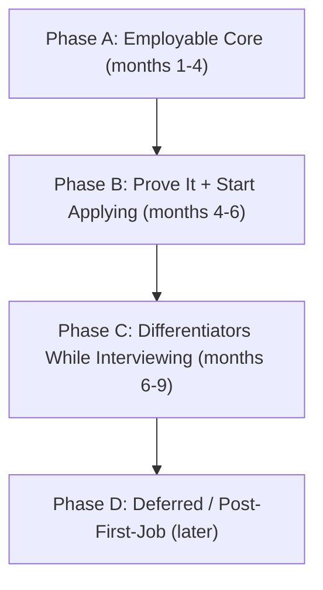

# Go Backend Path

> **Track:** Development · **Path:** Remote Go Backend Path
> 
> Complete curriculum exported from GoalTrack. Modules 0–23 cover environment setup through job hunt, with learn-by-doing projects at each stage. **Module 12** merges a hands-on AWS course (VPC, EC2, RDS, IAM, CloudWatch, Route 53, S3, CloudFront, ECS, Lambda) with Go deploy projects for `notes-api` and the Inventory Platform. The final **[Realistic Job Roadmap](#realistic-job-roadmap-sequencing--job-strategy)** section sequences these modules into phases and tells you when to start applying.

## At a glance

| Metric | Count |
|---|---|
| Modules | 24 (Modules 0–23) |
| Topics | 111 |
| Subtopics | 478 |
| Projects | 45 |
| Ongoing modules | 4 (Modules 18, 19, 21, 22) |

## Table of contents

- [Module 0: Developer Environment & Foundations](#module-0-developer-environment-foundations)
- [Module 1: Go Language Fundamentals](#module-1-go-language-fundamentals)
- [Module 2: Concurrency in Go](#module-2-concurrency-in-go)
- [Module 3: Testing & Quality](#module-3-testing-quality)
- [Module 4: HTTP & REST API Development](#module-4-http-rest-api-development)
- [Module 5: Databases & Persistence](#module-5-databases-persistence)
- [Module 6: Authentication, Authorization & Security](#module-6-authentication-authorization-security)
- [Module 7: Linux (Deep)](#module-7-linux-deep)
- [Module 8: Networking](#module-8-networking)
- [Module 9: Containers & Local Orchestration](#module-9-containers-local-orchestration)
- [Module 10: Observability & Reliability](#module-10-observability-reliability)
- [Module 11: Debugging & Profiling](#module-11-debugging-profiling)
- [Module 12: Cloud & Deployment (AWS) — Hands-on](#module-12-cloud-deployment-aws--hands-on)
- [Module 13: CI/CD & Automation](#module-13-cicd-automation)
- [Module 14: Kubernetes (Interview-Level Only)](#module-14-kubernetes-interview-level-only)
- [Module 15: gRPC & Inter-Service Communication](#module-15-grpc-inter-service-communication)
- [Module 16: System Design & Architecture](#module-16-system-design-architecture)
- [Module 17: AI Integration](#module-17-ai-integration)
- [Module 18: Reading Existing Code [Ongoing]](#module-18-reading-existing-code-ongoing) *(ongoing)*
- [Module 19: Communication & Remote Work [Ongoing]](#module-19-communication-remote-work-ongoing) *(ongoing)*
- [Module 20: API Documentation](#module-20-api-documentation)
- [Module 21: Open Source Contribution [Ongoing]](#module-21-open-source-contribution-ongoing) *(ongoing)*
- [Module 22: Engineering Mindset & Trade-offs [Ongoing]](#module-22-engineering-mindset-trade-offs-ongoing) *(ongoing)*
- [Module 23: Job Hunt & Interview Preparation](#module-23-job-hunt-interview-preparation)
- [Realistic Job Roadmap (sequencing & job strategy)](#realistic-job-roadmap-sequencing--job-strategy)

---

## Module 0: Developer Environment & Foundations

**Topics:** 4 · **Subtopics:** 25 · **Projects:** 2

### Topic 0.1: Computer & OS Basics

- CPU, RAM, disk, process, thread (conceptual)
- Client–server model
- Compiled vs interpreted (where Go fits)
- Editors vs IDEs (set up VS Code / Cursor)

### Topic 0.2: The Command Line (intro — deep Linux is Module 7)

- Navigation: `pwd`, `ls`, `cd`
- File ops: `mkdir`, `touch`, `cp`, `mv`, `rm`
- Viewing: `cat`, `less`, `head`, `tail`
- Pipes & redirection: `|`, `>`, `>>`, `<`
- Environment variables
- Searching: `grep`, `find`

### Topic 0.3: Git & GitHub

- What version control is and why
- `git init`, `git clone`
- Working dir → staging → commit
- `git add/commit/status/log/diff`
- Branches: `branch`, `switch`, `merge`
- Remotes: `push`, `pull`, `fetch`
- Pull requests & code review flow
- Merge conflicts and resolution
- `.gitignore`
- Commit hygiene
- Trunk-based vs GitFlow

### Topic 0.4: How the Web Works (conceptual; deep dive in Module 8)

- What a server is
- IP, ports, DNS (intro)
- Request/response cycle
- What an API is

### Projects

#### Project: [Beginner] GitHub Profile & First Repo

*Tier: Beginner*

- Profile README with bio, stack, and pinned repos plan
- Public repo initialized with `.gitignore` and license
- Meaningful commit history with conventional messages
- LinkedIn/GitHub cross-linked for recruiter discovery

#### Project: [Beginner] Git Workflow Practice Repo

*Tier: Beginner*

- ≥10 commits across ≥2 branches
- One self-opened PR with description and review checklist
- Intentional merge conflict created and resolved
- Trunk-based or GitFlow workflow documented in README

---

## Module 1: Go Language Fundamentals

**Topics:** 9 · **Subtopics:** 48 · **Projects:** 3

### Topic 1.1: Getting Started

- Install Go, `go version`
- Modules: `go mod init`, `go.mod`, `go.sum`
- First program: `package main`, `func main()`
- Tooling: `go run/build/fmt/vet/test`

### Topic 1.2: Basic Syntax & Types

- Variables: `var`, `:=`, zero values
- Constants and `iota`
- Basic types: `int`, `float64`, `bool`, `string`, `byte`, `rune`
- Type conversion
- Operators
- Comments

### Topic 1.3: Control Flow

- `if`/`else`, `if` with init statement
- `for` (all forms)
- `switch` (expression, type, fallthrough)
- `break`, `continue`, labels
- `defer` (execution order)

### Topic 1.4: Composite Types

- Arrays
- Slices: `append`, `len`, `cap`, slicing, copy, backing array
- Maps: access, comma-ok, delete, iterate
- Strings: immutability, runes vs bytes, UTF-8, `strings`, `strconv`
- Structs: literals, embedding/composition
- Pointers: `&`, `*`, nil pointers

### Topic 1.5: Functions

- Params, returns, multiple returns, named returns
- Variadic functions
- First-class functions
- Closures
- Recursion

### Topic 1.6: Methods & Interfaces

- Value vs pointer receivers (and when to use each)
- Interfaces, implicit satisfaction
- Empty interface (`any`)
- Type assertions, type switches
- Common interfaces: `Stringer`, `error`, `io.Reader`, `io.Writer`
- Interface composition, polymorphism

### Topic 1.7: Error Handling

- The `error` type
- `errors.New`, `fmt.Errorf`, `%w` wrapping
- `errors.Is`, `errors.As`
- Sentinel and custom errors
- `panic` / `recover` (and when not to)
- Errors-as-values philosophy

### Topic 1.8: Packages & Project Structure

- Creating packages
- Exported vs unexported
- `import`, aliases
- `init()`
- Layout: `cmd/`, `internal/`, `pkg/`
- Doc comments / `go doc`

### Topic 1.9: Generics

- Type parameters `[T any]`
- Constraints (`comparable`, custom)
- Generic functions/types
- When generics help vs hurt

### Projects

#### Project: [Beginner] cli-todo

*Tier: Beginner*

- Add/list/complete/delete tasks via CLI flags or subcommands
- JSON or text file persistence between runs
- `go mod init`, tests with table-driven cases
- README with install, usage, and design notes

#### Project: [Beginner] unit-converter & word-counter

*Tier: Beginner*

- unit-converter: length/weight/temp with clear error messages
- word-counter: stdin/file input, line/word/char stats
- Both use `flag` or cobra; `go vet` and `go test` clean

#### Project: [Medium] Generic Stack[T] & Queue[T]

*Tier: Medium*

- Type-parameter stack with Push/Pop/Peek/Len
- Type-parameter queue with Enqueue/Dequeue
- Table-driven tests; benchmark Push/Pop vs slice-only baseline
- Short blog-style comment on when generics help vs hurt

---

## Module 2: Concurrency in Go

**Topics:** 5 · **Subtopics:** 24 · **Projects:** 3

### Topic 2.1: Goroutines

- Goroutine vs OS thread
- Launching with `go`
- The scheduler (conceptual)
- Goroutine leaks

### Topic 2.2: Channels

- Send/receive, unbuffered vs buffered
- Channel direction
- Closing, ranging
- `nil` channel behavior

### Topic 2.3: Synchronization

- `select`, `select` with `default`
- Timeouts with `time.After`
- `sync.WaitGroup`, `Mutex`, `RWMutex`, `Once`
- `sync/atomic`
- Race conditions + race detector (`-race`)

### Topic 2.4: context Package

- Why context exists
- `Background`, `TODO`
- `WithCancel`, `WithTimeout`, `WithDeadline`
- `WithValue` (and caveats)
- Propagation through call chains

### Topic 2.5: Concurrency Patterns

- Worker pool
- Fan-out / fan-in
- Pipelines
- Rate limiting (ticker, token bucket)
- Graceful shutdown (context + signals)
- `errgroup`

### Projects

#### Project: [Medium] concurrent-fetcher

*Tier: Medium*

- Fetch N URLs concurrently with worker pool
- Configurable concurrency limit and timeout per request
- Aggregate status codes, timings, and errors
- `go test -race` clean; document leak avoidance

#### Project: [Medium] rate-limiter library

*Tier: Medium*

- Token-bucket or sliding-window limiter package
- Examples: HTTP middleware + CLI demo
- Benchmarks; README with complexity and trade-offs

#### Project: [Advanced] parallel-file-processor

*Tier: Advanced*

- Walk directory; hash or transform files in parallel pipeline
- Graceful shutdown on SIGINT using context
- Fan-out/fan-in with errgroup; structured error reporting

---

## Module 3: Testing & Quality

**Topics:** 3 · **Subtopics:** 12 · **Projects:** 2

### Topic 3.1: Unit Testing

- `testing`, `*_test.go`
- `t.Error` vs `t.Fatal`
- Table-driven tests, subtests (`t.Run`)
- Coverage

### Topic 3.2: Advanced Testing

- `TestMain`, setup/teardown
- Mocking via interfaces + dependency injection
- `httptest`
- Integration tests with real DB
- Test containers (Postgres)
- Benchmarks, fuzzing, golden files

### Topic 3.3: TDD

- Red-green-refactor
- Testify (`assert`, `require`, `mock`)

### Projects

#### Project: [Medium] Test Suite Retrofit (prior projects)

*Tier: Medium*

- Add table-driven tests to cli-todo and concurrent-fetcher
- >70% coverage on concurrent-fetcher (report in README)
- Subtests for edge cases; `-coverprofile` artifact in repo

#### Project: [Beginner] Testify & Mock Exercise

*Tier: Beginner*

- Small service with interface + mock implementation (testify/mock)
- HTTP handler tested with httptest
- Document red-green-refactor cycle used on one feature

---

## Module 4: HTTP & REST API Development

**Topics:** 8 · **Subtopics:** 40 · **Projects:** 3

### Topic 4.1: HTTP Fundamentals

- Methods (GET/POST/PUT/PATCH/DELETE)
- Status codes (know common ones cold)
- Headers, body, content negotiation
- Idempotency & safety
- Cookies vs headers
- HTTPS/TLS (intro; deep in Module 8)

### Topic 4.2: net/http

- `http.Server`, `ListenAndServe`
- Handlers, `HandlerFunc`
- `ServeMux` + Go 1.22 routing (`GET /notes/{id}`)
- Reading params/body
- JSON responses (`encoding/json`)
- Server timeouts, graceful shutdown

### Topic 4.3: REST API Design

- REST principles, resources
- URL design & versioning
- Validation
- Consistent error responses
- Pagination, filtering, sorting
- Status-code selection

### Topic 4.4: Middleware

- Handler wrapping
- Logging, recovery, CORS
- Request/correlation ID
- Chaining

### Topic 4.5: Routers/Frameworks

- `chi` (in depth)
- `gin`, `echo` (awareness)
- Framework vs stdlib trade-offs

### Topic 4.6: Serialization

- JSON tags, custom marshaling
- Optional/unknown fields
- Protobuf (awareness)

### Topic 4.7: HTTP Clients & Consuming APIs

- `http.Client` (never use the default client with no timeout)
- Building requests: `http.NewRequestWithContext`, methods, query params
- Timeouts, context cancellation, connection reuse (keep-alive)
- Auth to third-party APIs: API keys, Bearer tokens, headers
- Parsing responses: status-code handling, decoding JSON, error bodies
- Retries with backoff and jitter; which requests are safe to retry
- Handling upstream pagination and rate limits (429 + `Retry-After`)

### Topic 4.8: Webhooks

- What webhooks are (inbound HTTP callbacks vs polling)
- Receiving and routing webhook events
- Signature verification (HMAC shared secret) and replay protection
- Idempotency and deduplication via event IDs
- Respond fast (2xx) then process async (hand off to a worker/queue)
- Retries and out-of-order delivery from providers

### Projects

#### Project: [Beginner] notes-api-inmemory

*Tier: Beginner*

- CRUD REST API for notes (in-memory store)
- JSON request/response; consistent error envelope
- Logging + recovery middleware; httptest for handlers
- Chi or stdlib ServeMux with Go 1.22 routing

#### Project: [Medium] REST API Hardening Pass

*Tier: Medium*

- Pagination, filtering, validation on notes-api-inmemory
- Request ID middleware; CORS configured correctly
- OpenAPI-style endpoint table in README

#### Project: [Medium] API Client + Inbound Webhook Handler

*Tier: Medium*

- Consume a real third-party API with a timeout-configured `http.Client`
- Context cancellation + retry with backoff on 5xx/429
- Inbound webhook endpoint with HMAC signature verification
- Idempotent event handling (dedupe by event ID); fast 2xx then async process
- Tests with `httptest` for both the client (mock server) and webhook receiver

---

## Module 5: Databases & Persistence

**Topics:** 6 · **Subtopics:** 34 · **Projects:** 2

### Topic 5.1: Relational Fundamentals

- Tables, rows, columns, types
- Keys, relationships (1-1, 1-many, many-many)
- Normalization (1NF–3NF), when to denormalize
- ER modeling

### Topic 5.2: SQL

- `SELECT/WHERE/ORDER BY/LIMIT/OFFSET`
- `INSERT/UPDATE/DELETE`
- JOINs, `GROUP BY`, `HAVING`, aggregates
- Subqueries, CTEs
- Indexes (types, cost)
- `EXPLAIN` / query plans

### Topic 5.3: PostgreSQL

- Running locally + Docker, `psql`
- Types (`jsonb`, arrays, `uuid`, timestamptz)
- Constraints, sequences
- Transactions, ACID, isolation levels
- Row locking (`FOR UPDATE`), deadlocks
- Connection pooling
- Postgres vs MySQL (trade-offs)

### Topic 5.4: Go + Database

- `database/sql`, drivers (`pgx`/`lib/pq`)
- `QueryRow/Query/Exec`, scanning, `ErrNoRows`
- Prepared statements, SQL injection prevention
- Transactions in Go (`defer` rollback)
- Pool tuning
- `sqlc`, GORM (trade-offs)

### Topic 5.5: Migrations

- Why migrations exist
- `golang-migrate` up/down
- Versioning + running in CI/deploy

### Topic 5.6: Redis & Caching

- In-memory KV store
- Data types (string, hash, list, set, zset)
- TTL/expiration
- Use cases: cache, sessions, rate limit, queues
- Cache-aside, write-through
- Invalidation problems
- `go-redis`
- Redis vs querying Postgres (trade-offs)

### Projects

#### Project: [Medium] notes-api (Postgres + Redis)

*Tier: Medium*

- Postgres schema with migrations (golang-migrate)
- CRUD via database/sql or pgx; connection pool tuned
- Redis cache-aside for hot reads or session store
- docker-compose for local dev; integration tests

#### Project: [Advanced] E-commerce Schema Design

*Tier: Advanced*

- ER diagram: users, products, orders, order_items, inventory
- Normalization notes + intentional denormalization choices
- Sample SQL: JOINs, aggregates, index recommendations
- DECISIONS.md with Postgres vs MySQL rationale

---

## Module 6: Authentication, Authorization & Security

**Topics:** 3 · **Subtopics:** 17 · **Projects:** 2

### Topic 6.1: Authentication

- bcrypt hashing, salt, cost
- Session-based auth (cookies)
- JWT structure, signing (HS256/RS256)
- Access vs refresh tokens
- Expiry & revocation (Redis blocklist)
- JWT vs sessions (trade-offs)

### Topic 6.2: Authorization

- AuthN vs AuthZ
- RBAC
- Ownership checks
- Permissions/scopes
- Middleware-based authz

### Topic 6.3: Web Security Essentials

- OWASP Top 10 (awareness)
- SQL injection, XSS, CSRF
- Input validation/sanitization
- Rate limiting / brute-force protection
- Secrets management
- HTTPS/TLS, secure headers, CORS done right

### Projects

#### Project: [Medium] Secure notes-api (JWT + RBAC)

*Tier: Medium*

- bcrypt password hashing; register/login endpoints
- JWT access + refresh tokens; rotation strategy documented
- RBAC: admin / editor / viewer roles on note resources
- Login rate limiting; Redis blocklist for revoked tokens

#### Project: [Advanced] Security Hardening Checklist

*Tier: Advanced*

- Input validation on all write endpoints
- Security headers middleware; HTTPS-only cookies if session used
- OWASP Top 10 self-audit checklist filled for notes-api

---

## Module 7: Linux (Deep)

**Topics:** 8 · **Subtopics:** 24 · **Projects:** 2

### Topic 7.1: Core Linux

- Filesystem hierarchy
- Permissions (`chmod`, `chown`, rwx, octal)
- Users, groups, `sudo`
- Package manager (`apt`)
- Set up WSL or a free-tier Linux VM

### Topic 7.2: Processes & Files

- Processes: `ps`, `top`/`htop`, `kill`, signals (SIGTERM/SIGINT/SIGKILL)
- File descriptors (stdin/stdout/stderr, limits, `lsof`)
- Redirection deep dive

### Topic 7.3: Services & Scheduling

- systemd / systemctl (writing a unit file to run your Go service)
- journalctl (reading service logs)
- cron (scheduled jobs)

### Topic 7.4: Editors & Multiplexers

- vim basics (modes, edit, save/quit, search/replace)
- tmux (sessions, windows, panes — essential for SSH work)

### Topic 7.5: Networking & Remote Access

- ssh + ssh-agent + key management
- `scp`, `rsync`
- curl mastery (methods, headers, data, auth, following redirects, timing)
- `jq` for parsing/filtering JSON responses on the command line
- `wget`, `netstat`/`ss`, `ping`

### Topic 7.6: Web Server / Proxy

- nginx config (server blocks, reverse proxy to your Go app, TLS, static files)

### Topic 7.7: Archiving & Compression

- tar
- gzip
- `zip`/`unzip`

### Topic 7.8: Shell Scripting

- Variables, conditionals, loops
- Writing deploy/util scripts

### Projects

#### Project: [Advanced] notes-api on Linux VM

*Tier: Advanced*

- Deploy notes-api on WSL or free-tier Linux VM
- systemd unit file; service survives reboot
- nginx reverse proxy with TLS (self-signed or Let's Encrypt)
- Bash deploy script: build, migrate, restart, health check

#### Project: [Medium] Linux Ops Runbook

*Tier: Medium*

- Document: permissions fix, log locations, restart procedure
- journalctl queries for debugging 5xx errors
- tmux session recipe for long-running dev on SSH

---

## Module 8: Networking

**Topics:** 5 · **Subtopics:** 13 · **Projects:** 2

### Topic 8.1: The Stack

- OSI/TCP-IP layers (conceptual)
- TCP vs UDP (when each is used)
- NAT (private vs public IPs, port forwarding)

### Topic 8.2: Naming & Security

- DNS (records, resolution, caching)
- TLS handshake (certificates, SNI, what actually happens)

### Topic 8.3: HTTP in Depth

- HTTP/1.1 (connections, methods, headers)
- Keep-Alive and connection reuse
- HTTP/2 (multiplexing, vs HTTP/1.1)
- Status codes & caching headers

### Topic 8.4: Delivery & Routing

- Reverse proxy (concept + nginx)
- Load balancers (L4 vs L7, algorithms)

### Topic 8.5: Real-time & RPC Transport

- WebSockets (handshake, use cases)
- gRPC transport (HTTP/2 based — connects to Module 15)

### Projects

#### Project: [Medium] Network Labs Bundle

*Tier: Medium*

- Inspect TLS handshake with `openssl s_client` (notes in repo)
- Tiny WebSocket echo server in Go
- nginx L7 load balancer over 2 app instances
- Diagram: request path client → nginx → app → DB

#### Project: [Medium] url-shortener

*Tier: Medium*

- Short-code generation; redirect endpoint
- Postgres persistence; collision handling
- Rate limit creation endpoint; analytics optional
- Second pinned repo quality README + live demo optional

---

## Module 9: Containers & Local Orchestration

**Topics:** 2 · **Subtopics:** 14 · **Projects:** 2

### Topic 9.1: Docker

- Containers vs VMs
- Images vs containers
- Dockerfile: `FROM/WORKDIR/COPY/RUN/CMD/ENTRYPOINT/EXPOSE`
- Building, tags
- Running: ports, volumes, env
- Multi-stage builds (static Go binaries)
- `.dockerignore`, layers & caching
- `docker exec` / shell into containers; logs & debugging
- Publish images to a registry (Docker Hub / GHCR / ECR) with `docker push`
- Why containerize (trade-offs)

### Topic 9.2: Docker Compose

- `docker-compose.yml`
- Multi-service (app + Postgres + Redis)
- Networks, volumes, health checks
- `depends_on` / startup ordering

### Projects

#### Project: [Advanced] Full Docker Compose Stack

*Tier: Advanced*

- Multi-stage Dockerfile (static Go binary)
- compose: app + Postgres + Redis + healthchecks
- Volumes for data; `.dockerignore` optimized for layer cache
- Tag and push the image to a registry (Docker Hub / GHCR)
- One-command `docker compose up` documented

#### Project: [Capstone] Capstone Milestone — Containerize Platform

*Tier: Capstone*

- Inventory/capstone app containerized with compose
- All services networked; secrets via env files (not committed)
- Smoke test script run in CI

---

## Module 10: Observability & Reliability

**Topics:** 4 · **Subtopics:** 19 · **Projects:** 2

### Topic 10.1: Logging

- Structured logging (`slog`)
- Levels, correlation IDs
- What not to log (secrets/PII)
- Log storage & routing: console, files, syslog; rotation for long-running services
- Log security: PII filtering/obfuscation, safe error-response logging, encryption at rest

### Topic 10.2: Metrics & Monitoring

- Counter, gauge, histogram
- Prometheus + `/metrics`
- Instrumenting Go
- Grafana (awareness)
- Four golden signals

### Topic 10.3: Tracing & Health

- Distributed tracing concepts: spans, trace IDs, context propagation
- OpenTelemetry SDK in Go: instrument HTTP handlers and outbound calls
- Export traces to Jaeger; read a trace to find the latency bottleneck
- `/healthz`, `/readyz`
- Graceful degradation

### Topic 10.4: Background Workers & Queues

- Why background jobs
- In-process workers
- Redis-backed queues (`asynq`)
- Retries, idempotency, dead-letter

### Projects

#### Project: [Medium] Observability Upgrade (notes-api or capstone)

*Tier: Medium*

- Structured logging with `slog` + correlation IDs; PII obfuscation on sensitive fields
- Prometheus `/metrics` (latency, errors, in-flight)
- Distributed tracing with OpenTelemetry exported to Jaeger (one request traced end-to-end)
- Background email/job worker with retries + dead-letter note
- `/healthz` and `/readyz` endpoints

#### Project: [Capstone] Capstone Milestone — Metrics Dashboard

*Tier: Capstone*

- Prometheus metrics on capstone; Grafana screenshot or config
- Alert-worthy SLO defined (e.g. p99 latency, error rate)

---

## Module 11: Debugging & Profiling

**Topics:** 3 · **Subtopics:** 13 · **Projects:** 2

### Topic 11.1: Debugging

- Delve (Go debugger): breakpoints, stepping, inspecting variables
- Stack traces: reading them
- Panic analysis: interpreting panic output
- Goroutine dumps (`SIGQUIT`, full goroutine stack)

### Topic 11.2: Profiling with pprof

- CPU profile
- Heap / memory profile
- Goroutine profile
- Memory profiling for leaks
- Capturing via `net/http/pprof`
- Visualizing (`go tool pprof`, flame graphs)

### Topic 11.3: Finding Bottlenecks

- Benchmark + profile workflow
- Identifying hot paths
- Common Go performance pitfalls (allocations, copying)

### Projects

#### Project: [Advanced] pprof Bottleneck Hunt & Fix

*Tier: Advanced*

- Introduce deliberate CPU or alloc hotspot in a service
- Capture CPU + heap profiles via net/http/pprof
- Flame graph or `go tool pprof` analysis in docs
- Before/after benchmark numbers after fix

#### Project: [Beginner] Delve Debugging Exercise

*Tier: Beginner*

- Reproduce bug; fix using Delve breakpoints
- Document panic stack trace reading steps
- Goroutine dump analysis write-up (SIGQUIT)

---

## Module 12: Cloud & Deployment (AWS) — Hands-on

**Topics:** 13 · **Subtopics:** 63 · **Projects:** 4

> **How this module works:** Learn AWS from the ground up by building real infrastructure yourself, then apply every chapter to **your** Go apps (`notes-api`, Inventory Platform). Order matters: Cloud → VPC → IAM → compute/data → delivery → containers → serverless (optional) → IaC awareness. Complete M7–M9 (Linux, networking, Docker) before this module.

### Topic 12.1: Cloud Computing

- IaaS / PaaS / SaaS and where AWS fits
- AWS accounts, Free Tier, and billing alerts
- Regions, availability zones, and latency trade-offs
- Shared responsibility model
- Cost models: on-demand vs reserved vs spot (awareness)
- Cost traps for beginners (idle EC2, public data transfer, NAT Gateway)

### Topic 12.2: Networking — VPCs

- VPC, CIDR blocks, and isolation
- Public vs private subnets
- Route tables, Internet Gateway, NAT Gateway (when you need it)
- Security groups vs network ACLs (conceptual)
- Why apps sit in private subnets behind a public load balancer
- Building a VPC suitable for a secure app deployment
- Diagram: client → ALB → app subnet → RDS subnet

### Topic 12.3: IAM — Identity and Access Management

- Root account hygiene (MFA; never use root for daily work)
- IAM users, groups, roles, and policies
- Least-privilege policies for deployed apps
- Instance / task roles vs long-lived access keys
- Cross-service access patterns (ECS → S3, Lambda → RDS)
- Documenting who can do what in your project README

### Topic 12.4: EC2 — Elastic Compute Cloud

- AMIs, instance types, key pairs
- Launching and connecting via SSH (ties to M7)
- Security groups as instance firewalls
- User data / bootstrap scripts for Go binaries
- Elastic IPs and when not to use them
- Scaling concepts (manual → ASG awareness)
- Production workflow: build → deploy → health check → rollback

### Topic 12.5: RDS — Relational Database Service

- Managed PostgreSQL on RDS (matches M5)
- Instance sizing, storage, and Multi-AZ (awareness)
- Automated backups and restore basics
- Security: private subnet, security groups, no public DB
- Connecting a Go app (`database/sql` / pgx) to RDS
- Parameter groups and connection limits (awareness)

### Topic 12.6: Monitoring — CloudWatch

- Metrics, logs, and alarms
- Shipping application logs from EC2/ECS
- Alerts for CPU, 5xx, and disk/memory (where available)
- Dashboards for a healthy production system
- Ties to M10 (Prometheus locally vs CloudWatch on AWS)

### Topic 12.7: DNS — Route 53

- Hosted zones and common record types (A, CNAME, ALIAS)
- Pointing a domain at ALB or CloudFront
- Health checks and simple failover (awareness)
- Reliable user access to apps hosted on AWS

### Topic 12.8: S3 — Simple Storage Service

- Buckets, objects, prefixes, and regions
- Object permissions and bucket policies
- Block Public Access and least-privilege access
- Production patterns: app uploads, static assets, backups
- Capstone use case: file uploads / report exports

### Topic 12.9: CDN — CloudFront

- Why a CDN (latency, caching, TLS at the edge)
- CloudFront in front of S3 and/or ALB
- Cache behaviors and invalidation basics
- Speeding up global delivery of static assets and APIs (where appropriate)

### Topic 12.10: ECS — Elastic Container Service

- Containers on AWS without deep Kubernetes (ties to M9)
- ECR: build, tag, push Go images
- Task definitions, services, and desired count
- ECS on EC2 vs **Fargate** (choose one primary path; know both)
- Application Load Balancer (ALB) in front of ECS services
- Health checks, rolling updates, and scaling services
- ECS vs EKS (talking level — deep K8s waits for M14 / on the job)
- ElastiCache (managed Redis) — awareness for cache/rate-limit in prod

### Topic 12.11: Serverless Functions — Lambda

- When Lambda fits vs always-on ECS (trade-offs)
- Deploying a Go or managed-runtime function
- API Gateway → Lambda for small production APIs
- Triggers, timeouts, cold starts (awareness)
- IAM roles for Lambda; CloudWatch logs
- Optional for first junior backend role — do after ECS is solid

### Topic 12.12: Delivery & TLS Extras

- Reverse proxy with nginx on EC2 (ties to M7 / M8)
- TLS certificates with ACM
- HTTPS end-to-end: Route 53 → CloudFront/ALB → service
- Comparing nginx-on-EC2 vs ALB+ECS for your apps

### Topic 12.13: Infrastructure as Code (awareness)

- What IaC is and why click-ops does not scale
- Terraform basics (resources, state — awareness)
- CloudFormation (awareness)
- Goal: be able to discuss IaC in interviews; automate later in M13

### Projects

#### Project: [Medium] VPC + IAM Lab

*Tier: Medium*

- Build a VPC with public and private subnets, route tables, and internet access
- Create least-privilege IAM roles/policies for a future app deploy
- Document the network diagram and cost notes (NAT vs public-only lab)
- No production secrets in the repo; use IAM roles, not committed keys

#### Project: [Advanced] Deploy notes-api to AWS

*Tier: Advanced*

- Preferred path: **ECS Fargate + ECR + ALB + RDS Postgres** (or EC2 + compose if cost-constrained)
- Live public URL with HTTPS (ACM)
- IAM least-privilege roles documented
- S3 bucket for uploads or static assets (if applicable)
- CloudWatch logs + at least one alarm
- Optional: Route 53 custom domain; CloudFront in front of static assets

#### Project: [Advanced] Lambda Stretch (optional)

*Tier: Advanced*

- One small API via API Gateway + Lambda (health check, webhook, or report trigger)
- CloudWatch logs; IAM role with least privilege
- Short DECISIONS.md: why this is Lambda vs part of the ECS service

#### Project: [Capstone] Capstone Milestone — AWS Production

*Tier: Capstone*

- Inventory Platform deployed with HTTPS on custom or AWS domain
- VPC-aware layout: ALB public, app + RDS private where practical
- RDS Postgres + optional ElastiCache/Redis
- S3 for file uploads / reports; CloudWatch monitoring
- Runbook: deploy, rollback, scale, and estimated monthly cost

### Suggested chapter order (merge of course + path)

```
12.1 Cloud Computing
  → 12.2 VPCs
  → 12.3 IAM
  → 12.4 EC2
  → 12.5 RDS
  → 12.6 CloudWatch
  → 12.8 S3
  → 12.7 Route 53
  → 12.12 ACM / nginx extras
  → 12.10 ECS (+ ECR + ALB)   ← primary deploy path for Go containers
  → 12.9 CloudFront
  → 12.11 Lambda (optional)
  → 12.13 IaC awareness
  → then Module 13 (CI/CD into AWS)
```

---


## Module 13: CI/CD & Automation

**Topics:** 6 · **Subtopics:** 23 · **Projects:** 2

### Topic 13.1: Concepts

- CI vs CD (delivery vs deployment)
- Pipeline stages: build → test → lint → security scan → package → deploy

### Topic 13.2: GitHub Actions

- Workflow YAML, triggers, jobs, steps, runners
- Caching deps
- `go test/vet`, linters
- Build + push Docker image
- Secrets in CI
- Deploy step to AWS

### Topic 13.3: Deployment Strategies

- Rolling deployments
- Blue-green deployments
- Feature flags
- Rollbacks

### Topic 13.4: Secrets Management

- Env-based secrets
- AWS Secrets Manager / SSM Parameter Store
- Never commit secrets; rotation basics

### Topic 13.5: Code Quality Automation

- `golangci-lint`
- `gofmt`/`goimports` checks
- Pre-commit hooks

### Topic 13.6: Security in CI

- `govulncheck` (known vulnerabilities in dependencies and the stdlib)
- `gosec` static analysis (SAST) for common Go security issues
- Dependency scanning and automated updates (Dependabot)
- Secret scanning to block committed credentials
- Fail the build on high-severity findings; triage and suppression workflow

### Projects

#### Project: [Advanced] Full GitHub Actions Pipeline

*Tier: Advanced*

- Workflow: test → lint (golangci-lint) → security scan (govulncheck + gosec) → build image → deploy
- Cache Go modules; matrix or single job documented
- Dependabot enabled; build fails on high-severity vulnerabilities
- Secrets from GitHub/SSM; no keys in repo
- Rolling or blue-green deploy strategy noted

#### Project: [Capstone] Capstone Milestone — CI/CD Complete

*Tier: Capstone*

- Capstone pipeline green on main; deploy on tag or merge
- Pre-commit hooks locally mirroring CI checks
- Badges in README: build, coverage, deploy status

---

## Module 14: Kubernetes (Interview-Level Only)

**Topics:** 2 · **Subtopics:** 7 · **Projects:** 1

### Topic 14.1: Core Concepts

- Pods
- Deployments
- Services
- Ingress

### Topic 14.2: Talking Points

- Why orchestration exists
- ECS vs EKS (revisit)
- What you'd learn next professionally

### Projects

#### Project: [Beginner] K8s Local Stretch (kind/minikube)

*Tier: Beginner*

- Deployment + Service + Ingress for capstone or notes-api
- Local image load or registry push documented
- Talking points doc: Pods vs Deployments vs Services

---

## Module 15: gRPC & Inter-Service Communication

**Topics:** 2 · **Subtopics:** 6 · **Projects:** 1

### Topic 15.1: Protocol Buffers

- `.proto`, messages, services
- Code generation (`protoc`)

### Topic 15.2: gRPC in Go

- Unary RPCs
- Streaming (awareness)
- gRPC vs REST (trade-offs)
- Interceptors

### Projects

#### Project: [Advanced] Internal gRPC Service (capstone)

*Tier: Advanced*

- `.proto` definition + generated Go stubs
- Unary RPC integrated into capstone (e.g. inventory lookup)
- Interceptor for logging/auth; gRPC vs REST trade-off in DECISIONS.md

---

## Module 16: System Design & Architecture

**Topics:** 4 · **Subtopics:** 16 · **Projects:** 2

### Topic 16.1: Architecture Patterns

- Layered (handler → service → store)
- Clean architecture / dependency direction
- Monolith vs microservices (junior-scale trade-offs)
- Dependency injection (manual, idiomatic)

### Topic 16.2: Scalability

- Stateless services + horizontal scaling
- Caching layers
- Read replicas (awareness)
- Load balancing
- Queues for decoupling

### Topic 16.3: Reliability & Failure

- Behavior under heavy load
- Timeouts, retries, circuit breakers (awareness)
- Idempotency keys
- Graceful shutdown / zero-downtime deploys

### Topic 16.4: Design Practice

- URL shortener
- Rate limiter
- Concurrency-safe inventory/stock system

### Projects

#### Project: [Medium] System Design Exercise Pack

*Tier: Medium*

- URL shortener: API + storage + scale notes (extend M8 project)
- Rate limiter design doc: token bucket at edge vs app
- Concurrency-safe inventory/stock: idempotency + locking strategy
- One-page diagrams per problem (Excalidraw or Mermaid in repo)

#### Project: [Capstone] Capstone Architecture RFC

*Tier: Capstone*

- RFC: layered handler → service → store for Inventory Platform
- Monolith vs microservices decision with junior-scale rationale
- Failure modes: DB down, queue backlog, 10k RPS sketch

---

## Module 17: AI Integration

**Topics:** 5 · **Subtopics:** 13 · **Projects:** 1

### Topic 17.1: LLM APIs

- Calling LLM APIs from Go (OpenAI/Anthropic-style)
- Streaming responses
- Tokens, cost, rate limits, error handling

### Topic 17.2: Prompt Engineering

- System vs user prompts
- Structured output (JSON)
- Guardrails and validation

### Topic 17.3: Embeddings & Retrieval

- Embeddings (what they are)
- Vector databases (pgvector, Pinecone — awareness)
- RAG (retrieval-augmented generation) pipeline

### Topic 17.4: Agents & Protocols

- AI agents (tools/function calling)
- Model Context Protocol (MCP) (what it is, why it matters)

### Topic 17.5: Building AI Features

- Adding an AI endpoint to a backend (e.g. semantic search, summarization)
- Caching AI responses, fallback handling

### Projects

#### Project: [Advanced] Capstone AI Feature

*Tier: Advanced*

- One AI endpoint (semantic search via embeddings + pgvector, or summarization)
- Prompt templates + structured JSON output validation
- Cost/rate-limit handling; cache repeated queries
- Fallback when model unavailable

---

## Module 18: Reading Existing Code [Ongoing]

*Ongoing module — revisit throughout the program.*

**Topics:** 3 · **Subtopics:** 8 · **Projects:** 1

### Topic 18.1: How to Read Code

- Start from entry points (`main`)
- Follow a single request end-to-end
- Read tests to understand behavior
- Take notes / draw the architecture

### Topic 18.2: What to Read (rotate)

- Go standard library (`net/http`, `io`, `sync`)
- High-quality open-source Go (`chi`, `golang-migrate`, `testify`)
- Docker, Prometheus, Kubernetes (selected packages)

### Topic 18.3: Output

- Weekly note: "what I read, what I learned, one pattern I'll reuse"

### Projects

#### Project: [Beginner] Weekly Code Reading Log

*Tier: Beginner*

- Week 1: trace one request through `net/http` or chi
- Week 2: read tests in an OSS repo to infer behavior
- Template: what I read → what I learned → pattern to reuse
- Minimum 2h/week logged in GoalTrack

---

## Module 19: Communication & Remote Work [Ongoing]

*Ongoing module — revisit throughout the program.*

**Topics:** 4 · **Subtopics:** 11 · **Projects:** 1

### Topic 19.1: Technical Writing

- Clear, concise written English
- Writing for an async remote audience

### Topic 19.2: GitHub Communication

- Writing good GitHub issues (repro, context, expected vs actual)
- Writing good pull requests (description, why, screenshots)
- Code review etiquette (giving + receiving feedback)

### Topic 19.3: Design Communication

- Writing RFCs / design docs
- Explaining architecture clearly
- Giving demos

### Topic 19.4: Spoken & Interpersonal

- Speaking English (practice explaining aloud)
- Asking questions professionally
- Conflict resolution in a team

### Projects

#### Project: [Beginner] Communication Templates Pack

*Tier: Beginner*

- GitHub issue template (repro, expected, actual, logs)
- PR template (why, what, how to test, screenshots)
- 3-minute capstone architecture script (record or written)
- One RFC or design doc peer-reviewed (self-review checklist)

---

## Module 20: API Documentation

**Topics:** 2 · **Subtopics:** 6 · **Projects:** 1

### Topic 20.1: Code & Repo Docs

- Writing excellent READMEs (setup, architecture, decisions)
- `DECISIONS.md` per project

### Topic 20.2: API Docs

- Swagger / OpenAPI (generate + serve)
- API versioning strategy
- Postman collections
- Rich API examples (curl + sample requests/responses)

### Projects

#### Project: [Medium] Capstone Documentation Suite

*Tier: Medium*

- OpenAPI/Swagger spec generated and served
- Postman collection with example requests/responses
- README: setup, architecture diagram, env vars, decisions
- DECISIONS.md with ≥5 trade-off entries

---

## Module 21: Open Source Contribution [Ongoing]

*Ongoing module — revisit throughout the program.*

**Topics:** 3 · **Subtopics:** 10 · **Projects:** 1

### Topic 21.1: Getting Started

- Finding beginner-friendly Go repos
- Reading CONTRIBUTING.md
- Fork + local dev setup

### Topic 21.2: Meaningful Contributions

- Bug fixes
- Test improvements
- Small features
- Reviewing PRs
- Good PR descriptions + responding to feedback

### Topic 21.3: Tracking

- PR tracker (repo, type, status, link)
- Target: 3–5 PRs during program; 10–20 over time (no typo-only PRs)

### Projects

#### Project: [Medium] Meaningful OSS Contributions

*Tier: Medium*

- PR tracker spreadsheet: repo, type, status, link
- 3–5 merged or in-review PRs (no typo-only)
- At least one test improvement or bug fix in a Go repo
- Review one external PR with constructive comments

---

## Module 22: Engineering Mindset & Trade-offs [Ongoing]

*Ongoing module — revisit throughout the program.*

**Topics:** 3 · **Subtopics:** 14 · **Projects:** 1

### Topic 22.1: The Trade-off Habit

- Why this? Why not the alternative?
- What are the trade-offs?
- What happens under heavy load?
- How does it fail? How would I debug it?

### Topic 22.2: Trade-off Question Bank

- JWT vs sessions?
- Postgres vs MySQL?
- Redis vs querying Postgres?
- Why containerize?
- RBAC vs ownership checks?
- Append-only ledger for stock?
- Background worker for emails?
- Connection pooling — what if exhausted?

### Topic 22.3: Documentation Practice

- `DECISIONS.md` everywhere
- Explain every decision aloud (recorded)

### Projects

#### Project: [Beginner] DECISIONS.md Everywhere

*Tier: Beginner*

- DECISIONS.md in cli-todo, notes-api, and capstone
- Answer trade-off bank: JWT vs sessions, Redis vs Postgres cache, etc.
- Record one 5-minute decision explanation (audio or written)

---

## Module 23: Job Hunt & Interview Preparation

**Topics:** 4 · **Subtopics:** 18 · **Projects:** 2

### Topic 23.1: Professional Profile

- 1-page backend resume (trade-off-driven bullets)
- GitHub pinned repos + READMEs
- LinkedIn headline/about + build-in-public
- Portfolio page

### Topic 23.2: Technical Articles

- 2 articles (e.g. "Why JWT over sessions", "Preventing double stock deduction")
- Publish on Dev.to / LinkedIn

### Topic 23.3: Applications

- Boards: Remote Rocketship, Wellfound, Remotive, RemoteOK, web3.career, WeWorkRemotely, LinkedIn
- Filter worldwide/anywhere + intern/junior
- Application tracker
- Tailored notes linking the live capstone
- 5–10 quality applications/week

### Topic 23.4: Interview Prep

- 3-minute project pitch
- Defend 3 `DECISIONS.md` entries
- Failure-mode questions ("what breaks at 10k RPS?", "how to debug a 500?")
- Concurrency Q&A
- SQL + transactions
- System design basics
- Mock interviews (record + review)

### Projects

#### Project: [Capstone] Inventory Management Platform (Capstone)

*Tier: Capstone*

- Auth JWT+refresh, RBAC admin/manager/viewer, audit logs
- Background workers, email notifications, S3 file uploads
- Reports export, Prometheus metrics, structured logging
- Docker compose, CI/CD, AWS live URL, OpenAPI + tests >70%
- Stretch: gRPC service + AI feature

#### Project: [Advanced] Job Hunt Launch Kit

*Tier: Advanced*

- 1-page backend resume with trade-off-driven bullets
- GitHub pinned: capstone + url-shortener + best CLI project
- Portfolio page or README index linking live demos
- Application tracker; 5–10 quality apps/week plan
- 2 technical articles published (Dev.to/LinkedIn)
- Mock interview recording reviewed with notes

---

## Capstone arc

Several modules include **capstone milestones** that build toward the final **Inventory Management Platform** (Module 23):

- **Module 9** — Containerize platform (Docker Compose)
- **Module 10** — Metrics dashboard (Prometheus/Grafana)
- **Module 12** — AWS production deployment (VPC → IAM → ECS/RDS/S3/CloudWatch; optional Lambda)
- **Module 13** — CI/CD pipeline complete
- **Module 16** — Architecture RFC
- **Module 23** — Full capstone + job hunt launch kit

---

## Realistic Job Roadmap (sequencing & job strategy)

The modules above are the **curriculum** ("what to learn"). This section is the **schedule
and strategy** ("in what order, and when do I start applying?") so you land a job instead
of studying forever.

### The honest reality

- The full curriculum is large: **24 modules, 111 topics, 478 subtopics, 45 projects.**
  "Finish everything, then apply" is the wrong strategy.
- A true beginner starting at Module 0, studying ~6 hrs/day, realistically needs
  **8-12 months** to complete the whole path. A narrower backend-only track alone is ~6 months.
- You become **employable** (able to pass junior/intern screens) far earlier - around the
  end of Phase B below - **not** after the last module.
- Therefore: **start applying in month 4-5**, while you keep learning. Interviews are a
  skill you build in parallel, not after.

#### What actually gets a junior callback

1. One or two **deployed, documented** projects (live URL + README + DECISIONS.md).
2. Git fluency, SQL, Docker, auth, and the ability to **explain trade-offs** out loud.
3. A profile that matches the job's keywords (see the Bangladesh note below).

You do **not** need gRPC, deep Kubernetes, AI integration, or Lambda to get a first job.

### The four phases



#### Phase A - Employable Core (months 1-4)

Modules: **M0, M1, M2, M3, M4, M5, M6, M9** (+ ongoing M18, M22 lightly).

Goal: you can build, test, containerize, and secure a real REST API backed by Postgres.

Deliverables:
- `notes-api` working locally: CRUD, JWT + RBAC, Postgres + migrations, Redis, tests,
  Docker Compose.
- One **Node.js or Python** REST API (small) for keyword match - see Bangladesh note.
- Git history that looks professional; every project has a README.

Exit check: you can explain "why JWT vs sessions", "why Postgres", "why Redis", and
"why containerize" without notes.

#### Phase B - Prove It + Start Applying (months 4-6)

Modules: **M7 (Linux), M8 (Networking), one deploy from M12** (VPC -> IAM -> EC2/ECS +
RDS). Begin ongoing **M19 (Communication), M21 (OSS), M23 (job hunt)**.

Goal: something is **live on the internet**, and applications are going out.

Deliverables:
- `notes-api` deployed with HTTPS on a public URL.
- Capstone **Inventory Platform - MVP** started (auth, RBAC, one core domain flow).
- Resume + LinkedIn + pinned GitHub repos ready (M23).
- **Applications: 5-10/week begin here.** Do not wait for the capstone to be "perfect".
- First 1-2 open-source PRs opened.

#### Phase C - Differentiators While Interviewing (months 6-9)

Modules: **M10 (Observability), M11 (Debugging/Profiling), M13 (CI/CD incl. security
scanning), M16 (System Design), M20 (API Docs)** + the gap-fill topics
(HTTP clients/webhooks in M4, tracing with Jaeger in M10).

Goal: your capstone looks like real startup software and you interview well.

Deliverables:
- Capstone finished: metrics (Prometheus/Grafana), tracing (OpenTelemetry + Jaeger),
  structured + secured logs, CI/CD with `govulncheck`/`gosec`, live on AWS.
- OpenAPI docs + Postman collection + DECISIONS.md with 5+ trade-off entries.
- 3-5 meaningful OSS PRs; 2 technical articles published.
- Mock interviews recorded and reviewed.

#### Phase D - Deferred / Post-First-Job (later, or only if a target role requires it)

Modules: **M14 deep Kubernetes, M15 gRPC, M17 AI Integration, M12 Lambda.**

These are excellent skills but they **do not raise junior callback rates** in most markets
and delay income if done before applying. Learn them:
- on the job, or
- when a specific job you want lists them as required, or
- after you have a first offer and want to level up.

### Minimum Employable Core (the "can I apply yet?" checklist)

You are ready to start applying when you can check all of these (end of Phase B):

- [ ] Go fundamentals + concurrency basics (M1, M2)
- [ ] Tests you actually wrote (unit + one integration) (M3)
- [ ] REST API with proper status codes, validation, middleware (M4)
- [ ] PostgreSQL: schema, joins, transactions, migrations (M5)
- [ ] Auth: bcrypt + JWT + RBAC (M6)
- [ ] Docker + docker-compose; image pushed to a registry (M9)
- [ ] Git/GitHub fluency, clean history, good READMEs (M0)
- [ ] Basic Linux + one **deployed live** service with HTTPS (M7, M12)
- [ ] Can explain trade-offs aloud (M22)
- [ ] Resume + LinkedIn + pinned repos (M23)

### Bangladesh market note (important for local applications)

- Most **junior backend roles in BD are Node.js or Python**, not Go. Your Go depth is
  ideal for **remote/global** roles and shines in interviews, but locally you will match
  more job keywords with at least **one Node.js (Express/Nest) or Python (FastAPI/Django)
  REST API** in your portfolio. Build it in Phase A - it is fast once you know backend
  concepts.
- "Junior DevOps" in BD often still expects **1-2 years** and sometimes **Azure**. Use
  your deployed capstone + CI/CD + Docker story to argue "project experience", and add
  **Azure basics** only if you are actively targeting those roles.
- Keep Go as your **primary** identity (it is a differentiator and pays well remotely);
  treat Node/Python as **keyword-matching secondary** skills.

### Application cadence (from Phase B onward)

- 5-10 tailored applications per week; track them (company, role, date, status, follow-up).
- Every application links your **live capstone URL** and a relevant repo.
- Boards: Remote Rocketship, Wellfound, Remotive, RemoteOK, web3.career, We Work Remotely,
  LinkedIn (global); Bdjobs, Niyog, LinkedIn Bangladesh (local).
- Ties into M23 job-hunt materials (resume, cover notes, interview prep, mock interviews).

### One-line summary

Do not add more content. **Resequence and apply earlier:** get to the Minimum Employable
Core (~month 4-5), ship one deployed project, start applying, and finish the
differentiators while you interview. Defer gRPC, deep K8s, AI, and Lambda until a job
needs them.

---

*Module 12 expanded manually to merge the hands-on AWS course with existing Go deploy projects. The Realistic Job Roadmap section was merged in from a former standalone doc. Re-sync GoalTrack sources (`go-backend-path.ts` / `go-backend-projects.ts`) if you regenerate this doc.*